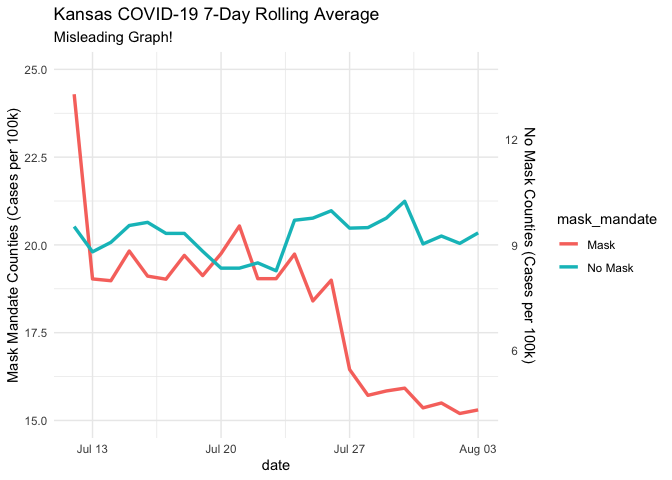
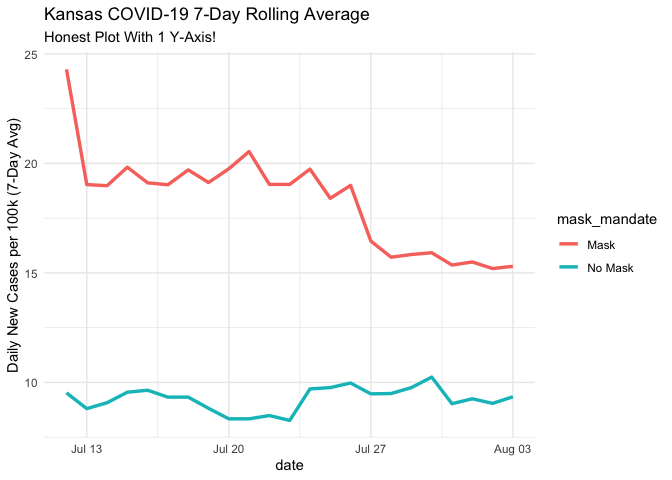
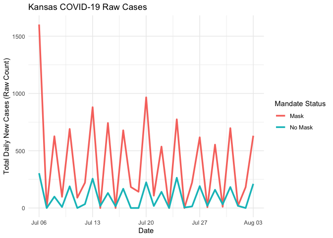

Lab 07 - Conveying the right message through visualisation
================
Haley Lam
03-23-26

### Load packages and data

``` r
library(tidyverse)
```

    ## ── Attaching core tidyverse packages ──────────────────────── tidyverse 2.0.0 ──
    ## ✔ dplyr     1.1.4     ✔ readr     2.1.5
    ## ✔ forcats   1.0.1     ✔ stringr   1.5.2
    ## ✔ ggplot2   4.0.0     ✔ tibble    3.3.0
    ## ✔ lubridate 1.9.4     ✔ tidyr     1.3.1
    ## ✔ purrr     1.1.0     
    ## ── Conflicts ────────────────────────────────────────── tidyverse_conflicts() ──
    ## ✖ dplyr::filter() masks stats::filter()
    ## ✖ dplyr::lag()    masks stats::lag()
    ## ℹ Use the conflicted package (<http://conflicted.r-lib.org/>) to force all conflicts to become errors

``` r
library(scales)
```

    ## 
    ## Attaching package: 'scales'
    ## 
    ## The following object is masked from 'package:purrr':
    ## 
    ##     discard
    ## 
    ## The following object is masked from 'package:readr':
    ## 
    ##     col_factor

``` r
library(lubridate)
library(zoo)
```

    ## Warning: package 'zoo' was built under R version 4.5.2

    ## 
    ## Attaching package: 'zoo'
    ## 
    ## The following objects are masked from 'package:base':
    ## 
    ##     as.Date, as.Date.numeric

``` r
df <- read_csv("kansas_grouped_rolling_avg.csv")
```

    ## Rows: 46 Columns: 3
    ## ── Column specification ────────────────────────────────────────────────────────
    ## Delimiter: ","
    ## chr  (1): mask_mandate
    ## dbl  (1): rolling_avg
    ## date (1): date
    ## 
    ## ℹ Use `spec()` to retrieve the full column specification for this data.
    ## ℹ Specify the column types or set `show_col_types = FALSE` to quiet this message.

### Exercise 1

Here’s some information about the data and the graph:

State: Kansas. Timeframe: 2020, July 13 to August 3. What’s being
measured: Average of daily cases per 100k population (i.e., it’s
adjusted for population size). Two groups: Counties with mask mandates
vs. counties without mask mandates. Source of data: Kansas Department of
Health and Environment

### Exercise 2

These counties did not opt out of their mask mandates: Allen, Atchison,
Bourbon, Crawford, Dickinson, Douglas, Franklin, Geary, Gove, Harvey,
Jewell, Johnson, Mitchell, Montgomery, Morris, Pratt, Reno, Republic,
Saline, Scott, Sedgwick, Shawnee, Stanton, and Wyandotte.

“Daily county-level COVID-19 incidence (cases per 100,000 population)
was calculated using case and population counts accessed from
USAFacts” - the data for cases and population came from USAFacts. They
provide a link in the footnotes.

### Exercise 3

Load files using webpage URLs

``` r
cases_raw <- read_csv(
  "https://static.usafacts.org/public/data/covid-19/covid_confirmed_usafacts.csv",
  show_col_types = FALSE
  )
pop_raw <- read_csv(
  "https://static.usafacts.org/public/data/covid-19/covid_county_population_usafacts.csv",
  show_col_types = FALSE
  )
```

``` r
glimpse(cases_raw)
```

    ## Rows: 3,193
    ## Columns: 1,269
    ## $ countyFIPS    <dbl> 0, 1001, 1003, 1005, 1007, 1009, 1011, 1013, 1015, 1017,…
    ## $ `County Name` <chr> "Statewide Unallocated", "Autauga County", "Baldwin Coun…
    ## $ State         <chr> "AL", "AL", "AL", "AL", "AL", "AL", "AL", "AL", "AL", "A…
    ## $ StateFIPS     <chr> "01", "01", "01", "01", "01", "01", "01", "01", "01", "0…
    ## $ `2020-01-22`  <dbl> 0, 0, 0, 0, 0, 0, 0, 0, 0, 0, 0, 0, 0, 0, 0, 0, 0, 0, 0,…
    ## $ `2020-01-23`  <dbl> 0, 0, 0, 0, 0, 0, 0, 0, 0, 0, 0, 0, 0, 0, 0, 0, 0, 0, 0,…
    ## $ `2020-01-24`  <dbl> 0, 0, 0, 0, 0, 0, 0, 0, 0, 0, 0, 0, 0, 0, 0, 0, 0, 0, 0,…
    ## $ `2020-01-25`  <dbl> 0, 0, 0, 0, 0, 0, 0, 0, 0, 0, 0, 0, 0, 0, 0, 0, 0, 0, 0,…
    ## $ `2020-01-26`  <dbl> 0, 0, 0, 0, 0, 0, 0, 0, 0, 0, 0, 0, 0, 0, 0, 0, 0, 0, 0,…
    ## $ `2020-01-27`  <dbl> 0, 0, 0, 0, 0, 0, 0, 0, 0, 0, 0, 0, 0, 0, 0, 0, 0, 0, 0,…
    ## $ `2020-01-28`  <dbl> 0, 0, 0, 0, 0, 0, 0, 0, 0, 0, 0, 0, 0, 0, 0, 0, 0, 0, 0,…
    ## $ `2020-01-29`  <dbl> 0, 0, 0, 0, 0, 0, 0, 0, 0, 0, 0, 0, 0, 0, 0, 0, 0, 0, 0,…
    ## $ `2020-01-30`  <dbl> 0, 0, 0, 0, 0, 0, 0, 0, 0, 0, 0, 0, 0, 0, 0, 0, 0, 0, 0,…
    ## $ `2020-01-31`  <dbl> 0, 0, 0, 0, 0, 0, 0, 0, 0, 0, 0, 0, 0, 0, 0, 0, 0, 0, 0,…
    ## $ `2020-02-01`  <dbl> 0, 0, 0, 0, 0, 0, 0, 0, 0, 0, 0, 0, 0, 0, 0, 0, 0, 0, 0,…
    ## $ `2020-02-02`  <dbl> 0, 0, 0, 0, 0, 0, 0, 0, 0, 0, 0, 0, 0, 0, 0, 0, 0, 0, 0,…
    ## $ `2020-02-03`  <dbl> 0, 0, 0, 0, 0, 0, 0, 0, 0, 0, 0, 0, 0, 0, 0, 0, 0, 0, 0,…
    ## $ `2020-02-04`  <dbl> 0, 0, 0, 0, 0, 0, 0, 0, 0, 0, 0, 0, 0, 0, 0, 0, 0, 0, 0,…
    ## $ `2020-02-05`  <dbl> 0, 0, 0, 0, 0, 0, 0, 0, 0, 0, 0, 0, 0, 0, 0, 0, 0, 0, 0,…
    ## $ `2020-02-06`  <dbl> 0, 0, 0, 0, 0, 0, 0, 0, 0, 0, 0, 0, 0, 0, 0, 0, 0, 0, 0,…
    ## $ `2020-02-07`  <dbl> 0, 0, 0, 0, 0, 0, 0, 0, 0, 0, 0, 0, 0, 0, 0, 0, 0, 0, 0,…
    ## $ `2020-02-08`  <dbl> 0, 0, 0, 0, 0, 0, 0, 0, 0, 0, 0, 0, 0, 0, 0, 0, 0, 0, 0,…
    ## $ `2020-02-09`  <dbl> 0, 0, 0, 0, 0, 0, 0, 0, 0, 0, 0, 0, 0, 0, 0, 0, 0, 0, 0,…
    ## $ `2020-02-10`  <dbl> 0, 0, 0, 0, 0, 0, 0, 0, 0, 0, 0, 0, 0, 0, 0, 0, 0, 0, 0,…
    ## $ `2020-02-11`  <dbl> 0, 0, 0, 0, 0, 0, 0, 0, 0, 0, 0, 0, 0, 0, 0, 0, 0, 0, 0,…
    ## $ `2020-02-12`  <dbl> 0, 0, 0, 0, 0, 0, 0, 0, 0, 0, 0, 0, 0, 0, 0, 0, 0, 0, 0,…
    ## $ `2020-02-13`  <dbl> 0, 0, 0, 0, 0, 0, 0, 0, 0, 0, 0, 0, 0, 0, 0, 0, 0, 0, 0,…
    ## $ `2020-02-14`  <dbl> 0, 0, 0, 0, 0, 0, 0, 0, 0, 0, 0, 0, 0, 0, 0, 0, 0, 0, 0,…
    ## $ `2020-02-15`  <dbl> 0, 0, 0, 0, 0, 0, 0, 0, 0, 0, 0, 0, 0, 0, 0, 0, 0, 0, 0,…
    ## $ `2020-02-16`  <dbl> 0, 0, 0, 0, 0, 0, 0, 0, 0, 0, 0, 0, 0, 0, 0, 0, 0, 0, 0,…
    ## $ `2020-02-17`  <dbl> 0, 0, 0, 0, 0, 0, 0, 0, 0, 0, 0, 0, 0, 0, 0, 0, 0, 0, 0,…
    ## $ `2020-02-18`  <dbl> 0, 0, 0, 0, 0, 0, 0, 0, 0, 0, 0, 0, 0, 0, 0, 0, 0, 0, 0,…
    ## $ `2020-02-19`  <dbl> 0, 0, 0, 0, 0, 0, 0, 0, 0, 0, 0, 0, 0, 0, 0, 0, 0, 0, 0,…
    ## $ `2020-02-20`  <dbl> 0, 0, 0, 0, 0, 0, 0, 0, 0, 0, 0, 0, 0, 0, 0, 0, 0, 0, 0,…
    ## $ `2020-02-21`  <dbl> 0, 0, 0, 0, 0, 0, 0, 0, 0, 0, 0, 0, 0, 0, 0, 0, 0, 0, 0,…
    ## $ `2020-02-22`  <dbl> 0, 0, 0, 0, 0, 0, 0, 0, 0, 0, 0, 0, 0, 0, 0, 0, 0, 0, 0,…
    ## $ `2020-02-23`  <dbl> 0, 0, 0, 0, 0, 0, 0, 0, 0, 0, 0, 0, 0, 0, 0, 0, 0, 0, 0,…
    ## $ `2020-02-24`  <dbl> 0, 0, 0, 0, 0, 0, 0, 0, 0, 0, 0, 0, 0, 0, 0, 0, 0, 0, 0,…
    ## $ `2020-02-25`  <dbl> 0, 0, 0, 0, 0, 0, 0, 0, 0, 0, 0, 0, 0, 0, 0, 0, 0, 0, 0,…
    ## $ `2020-02-26`  <dbl> 0, 0, 0, 0, 0, 0, 0, 0, 0, 0, 0, 0, 0, 0, 0, 0, 0, 0, 0,…
    ## $ `2020-02-27`  <dbl> 0, 0, 0, 0, 0, 0, 0, 0, 0, 0, 0, 0, 0, 0, 0, 0, 0, 0, 0,…
    ## $ `2020-02-28`  <dbl> 0, 0, 0, 0, 0, 0, 0, 0, 0, 0, 0, 0, 0, 0, 0, 0, 0, 0, 0,…
    ## $ `2020-02-29`  <dbl> 0, 0, 0, 0, 0, 0, 0, 0, 0, 0, 0, 0, 0, 0, 0, 0, 0, 0, 0,…
    ## $ `2020-03-01`  <dbl> 0, 0, 0, 0, 0, 0, 0, 0, 0, 0, 0, 0, 0, 0, 0, 0, 0, 0, 0,…
    ## $ `2020-03-02`  <dbl> 0, 0, 0, 0, 0, 0, 0, 0, 0, 0, 0, 0, 0, 0, 0, 0, 0, 0, 0,…
    ## $ `2020-03-03`  <dbl> 0, 0, 0, 0, 0, 0, 0, 0, 0, 0, 0, 0, 0, 0, 0, 0, 0, 0, 0,…
    ## $ `2020-03-04`  <dbl> 0, 0, 0, 0, 0, 0, 0, 0, 0, 0, 0, 0, 0, 0, 0, 0, 0, 0, 0,…
    ## $ `2020-03-05`  <dbl> 0, 0, 0, 0, 0, 0, 0, 0, 0, 0, 0, 0, 0, 0, 0, 0, 0, 0, 0,…
    ## $ `2020-03-06`  <dbl> 0, 0, 0, 0, 0, 0, 0, 0, 0, 0, 0, 0, 0, 0, 0, 0, 0, 0, 0,…
    ## $ `2020-03-07`  <dbl> 0, 0, 0, 0, 0, 0, 0, 0, 0, 0, 0, 0, 0, 0, 0, 0, 0, 0, 0,…
    ## $ `2020-03-08`  <dbl> 0, 0, 0, 0, 0, 0, 0, 0, 0, 0, 0, 0, 0, 0, 0, 0, 0, 0, 0,…
    ## $ `2020-03-09`  <dbl> 0, 0, 0, 0, 0, 0, 0, 0, 0, 0, 0, 0, 0, 0, 0, 0, 0, 0, 0,…
    ## $ `2020-03-10`  <dbl> 0, 0, 0, 0, 0, 0, 0, 0, 0, 0, 0, 0, 0, 0, 0, 0, 0, 0, 0,…
    ## $ `2020-03-11`  <dbl> 0, 0, 0, 0, 0, 0, 0, 0, 0, 0, 0, 0, 0, 0, 0, 0, 0, 0, 0,…
    ## $ `2020-03-12`  <dbl> 0, 0, 0, 0, 0, 0, 0, 0, 0, 0, 0, 0, 0, 0, 0, 0, 0, 0, 0,…
    ## $ `2020-03-13`  <dbl> 0, 0, 0, 0, 0, 0, 0, 0, 0, 0, 0, 0, 0, 0, 0, 0, 0, 0, 0,…
    ## $ `2020-03-14`  <dbl> 0, 0, 1, 0, 0, 0, 0, 0, 0, 0, 0, 0, 0, 0, 0, 0, 0, 0, 0,…
    ## $ `2020-03-15`  <dbl> 0, 0, 1, 0, 0, 0, 0, 0, 0, 0, 0, 0, 0, 0, 0, 0, 0, 0, 0,…
    ## $ `2020-03-16`  <dbl> 0, 0, 1, 0, 0, 0, 0, 0, 0, 0, 0, 0, 0, 0, 0, 0, 0, 0, 0,…
    ## $ `2020-03-17`  <dbl> 0, 0, 1, 0, 0, 0, 0, 0, 0, 0, 0, 0, 0, 0, 0, 0, 0, 0, 0,…
    ## $ `2020-03-18`  <dbl> 0, 0, 1, 0, 0, 0, 0, 0, 1, 0, 0, 0, 0, 0, 0, 0, 0, 0, 0,…
    ## $ `2020-03-19`  <dbl> 0, 0, 1, 0, 0, 0, 0, 0, 1, 1, 0, 0, 0, 0, 0, 0, 0, 0, 0,…
    ## $ `2020-03-20`  <dbl> 0, 0, 2, 0, 0, 0, 0, 0, 1, 1, 0, 0, 0, 0, 0, 0, 0, 0, 0,…
    ## $ `2020-03-21`  <dbl> 0, 0, 2, 0, 0, 0, 0, 0, 1, 1, 0, 0, 0, 0, 0, 0, 0, 0, 0,…
    ## $ `2020-03-22`  <dbl> 0, 0, 3, 0, 0, 0, 0, 0, 2, 2, 0, 0, 0, 0, 0, 0, 0, 0, 0,…
    ## $ `2020-03-23`  <dbl> 0, 0, 3, 0, 0, 0, 0, 0, 2, 2, 0, 0, 0, 0, 0, 0, 0, 0, 0,…
    ## $ `2020-03-24`  <dbl> 0, 1, 4, 0, 0, 0, 0, 0, 2, 5, 0, 0, 0, 0, 0, 0, 0, 0, 0,…
    ## $ `2020-03-25`  <dbl> 0, 4, 4, 0, 0, 1, 0, 1, 2, 10, 1, 1, 0, 0, 1, 1, 0, 1, 0…
    ## $ `2020-03-26`  <dbl> 0, 6, 5, 0, 0, 2, 2, 1, 2, 13, 1, 4, 1, 0, 1, 1, 0, 1, 0…
    ## $ `2020-03-27`  <dbl> 0, 6, 5, 0, 0, 5, 2, 1, 3, 15, 1, 7, 1, 0, 1, 3, 0, 1, 0…
    ## $ `2020-03-28`  <dbl> 0, 6, 10, 0, 0, 5, 2, 1, 3, 17, 1, 7, 1, 0, 2, 4, 0, 1, …
    ## $ `2020-03-29`  <dbl> 0, 6, 15, 0, 0, 5, 2, 1, 3, 27, 2, 8, 1, 0, 2, 5, 0, 2, …
    ## $ `2020-03-30`  <dbl> 0, 7, 18, 0, 2, 5, 2, 1, 9, 36, 2, 10, 2, 0, 2, 5, 0, 4,…
    ## $ `2020-03-31`  <dbl> 0, 7, 19, 0, 3, 5, 2, 1, 9, 36, 2, 11, 3, 0, 2, 5, 0, 4,…
    ## $ `2020-04-01`  <dbl> 0, 10, 23, 0, 3, 5, 2, 1, 11, 45, 2, 13, 4, 2, 3, 6, 0, …
    ## $ `2020-04-02`  <dbl> 0, 10, 25, 0, 4, 6, 2, 1, 12, 67, 4, 14, 4, 2, 7, 6, 3, …
    ## $ `2020-04-03`  <dbl> 0, 12, 28, 1, 4, 9, 2, 1, 20, 81, 5, 15, 4, 3, 8, 7, 6, …
    ## $ `2020-04-04`  <dbl> 0, 12, 29, 2, 4, 10, 2, 1, 21, 87, 6, 15, 4, 7, 9, 7, 7,…
    ## $ `2020-04-05`  <dbl> 0, 12, 34, 2, 7, 10, 2, 1, 24, 90, 6, 18, 5, 9, 9, 7, 7,…
    ## $ `2020-04-06`  <dbl> 0, 12, 38, 3, 7, 10, 2, 1, 38, 96, 6, 20, 6, 9, 9, 9, 8,…
    ## $ `2020-04-07`  <dbl> 0, 12, 42, 3, 8, 10, 2, 2, 48, 102, 6, 20, 6, 10, 9, 12,…
    ## $ `2020-04-08`  <dbl> 0, 12, 49, 3, 9, 10, 3, 3, 52, 140, 7, 22, 6, 10, 11, 12…
    ## $ `2020-04-09`  <dbl> 0, 17, 59, 7, 11, 11, 4, 3, 54, 161, 7, 25, 6, 13, 11, 1…
    ## $ `2020-04-10`  <dbl> 0, 17, 59, 9, 11, 12, 4, 3, 54, 171, 7, 27, 7, 13, 11, 1…
    ## $ `2020-04-11`  <dbl> 0, 19, 66, 10, 13, 12, 4, 6, 57, 184, 7, 30, 9, 15, 12, …
    ## $ `2020-04-12`  <dbl> 0, 19, 71, 10, 16, 13, 4, 7, 60, 200, 9, 30, 10, 19, 14,…
    ## $ `2020-04-13`  <dbl> 0, 19, 78, 10, 17, 15, 6, 8, 61, 212, 9, 33, 10, 19, 14,…
    ## $ `2020-04-14`  <dbl> 0, 23, 87, 11, 17, 16, 8, 8, 62, 216, 9, 33, 12, 21, 14,…
    ## $ `2020-04-15`  <dbl> 0, 25, 98, 13, 19, 17, 8, 11, 62, 227, 10, 37, 13, 22, 1…
    ## $ `2020-04-16`  <dbl> 0, 25, 102, 14, 23, 18, 8, 11, 63, 234, 11, 37, 13, 24, …
    ## $ `2020-04-17`  <dbl> 0, 25, 103, 15, 23, 20, 8, 13, 63, 236, 12, 37, 13, 24, …
    ## $ `2020-04-18`  <dbl> 0, 25, 109, 18, 26, 20, 9, 13, 66, 240, 12, 39, 14, 24, …
    ## $ `2020-04-19`  <dbl> 0, 27, 114, 20, 28, 21, 9, 14, 72, 246, 12, 42, 14, 24, …
    ## $ `2020-04-20`  <dbl> 0, 28, 117, 22, 32, 22, 11, 14, 80, 257, 12, 43, 17, 24,…
    ## $ `2020-04-21`  <dbl> 0, 30, 123, 28, 32, 26, 11, 15, 83, 259, 12, 44, 18, 24,…
    ## $ `2020-04-22`  <dbl> 0, 32, 132, 29, 33, 29, 11, 17, 85, 270, 12, 46, 21, 24,…
    ## $ `2020-04-23`  <dbl> 0, 33, 143, 30, 33, 31, 12, 19, 88, 275, 12, 47, 22, 24,…
    ## $ `2020-04-24`  <dbl> 0, 36, 147, 32, 34, 31, 12, 21, 89, 282, 12, 49, 25, 24,…
    ## $ `2020-04-25`  <dbl> 0, 37, 154, 33, 35, 31, 12, 28, 90, 284, 12, 49, 27, 25,…
    ## $ `2020-04-26`  <dbl> 0, 37, 161, 33, 38, 34, 12, 32, 90, 285, 14, 51, 32, 25,…
    ## $ `2020-04-27`  <dbl> 0, 39, 168, 35, 42, 34, 12, 34, 90, 289, 14, 51, 39, 27,…
    ## $ `2020-04-28`  <dbl> 0, 40, 171, 37, 42, 34, 12, 45, 92, 290, 15, 52, 39, 28,…
    ## $ `2020-04-29`  <dbl> 0, 42, 173, 37, 42, 36, 12, 51, 93, 290, 15, 52, 39, 31,…
    ## $ `2020-04-30`  <dbl> 0, 42, 174, 39, 42, 37, 13, 53, 93, 290, 15, 52, 43, 32,…
    ## $ `2020-05-01`  <dbl> 0, 42, 175, 42, 42, 39, 14, 65, 93, 290, 15, 52, 49, 34,…
    ## $ `2020-05-02`  <dbl> 0, 45, 181, 43, 42, 40, 14, 92, 98, 294, 15, 54, 49, 38,…
    ## $ `2020-05-03`  <dbl> 0, 48, 187, 45, 42, 40, 14, 105, 105, 300, 16, 57, 49, 4…
    ## $ `2020-05-04`  <dbl> 0, 53, 188, 45, 42, 40, 16, 114, 105, 302, 16, 58, 51, 4…
    ## $ `2020-05-05`  <dbl> 0, 53, 189, 47, 43, 40, 18, 120, 114, 304, 17, 60, 54, 4…
    ## $ `2020-05-06`  <dbl> 0, 58, 196, 47, 43, 42, 18, 130, 114, 306, 18, 61, 54, 4…
    ## $ `2020-05-07`  <dbl> 0, 61, 205, 51, 44, 44, 18, 155, 120, 308, 18, 63, 56, 5…
    ## $ `2020-05-08`  <dbl> 0, 67, 208, 53, 44, 44, 21, 162, 123, 311, 21, 63, 59, 5…
    ## $ `2020-05-09`  <dbl> 0, 68, 216, 58, 45, 44, 22, 178, 124, 314, 22, 64, 61, 5…
    ## $ `2020-05-10`  <dbl> 0, 74, 222, 59, 46, 44, 23, 189, 124, 316, 22, 65, 66, 5…
    ## $ `2020-05-11`  <dbl> 0, 84, 224, 61, 46, 45, 26, 196, 125, 319, 24, 67, 67, 6…
    ## $ `2020-05-12`  <dbl> 0, 91, 227, 67, 46, 45, 26, 224, 126, 324, 24, 69, 69, 6…
    ## $ `2020-05-13`  <dbl> 0, 93, 231, 69, 46, 45, 28, 230, 127, 324, 24, 73, 72, 6…
    ## $ `2020-05-14`  <dbl> 0, 103, 243, 74, 46, 45, 28, 249, 128, 326, 25, 74, 77, …
    ## $ `2020-05-15`  <dbl> 0, 103, 244, 79, 49, 45, 32, 258, 129, 326, 26, 75, 81, …
    ## $ `2020-05-16`  <dbl> 0, 110, 254, 79, 50, 45, 35, 271, 130, 328, 27, 77, 84, …
    ## $ `2020-05-17`  <dbl> 0, 110, 254, 81, 50, 46, 35, 272, 130, 328, 27, 77, 84, …
    ## $ `2020-05-18`  <dbl> 0, 120, 260, 85, 50, 47, 40, 285, 133, 329, 28, 79, 85, …
    ## $ `2020-05-19`  <dbl> 0, 127, 262, 90, 51, 47, 52, 295, 133, 329, 29, 80, 92, …
    ## $ `2020-05-20`  <dbl> 0, 136, 270, 96, 52, 47, 64, 312, 136, 330, 30, 83, 129,…
    ## $ `2020-05-21`  <dbl> 0, 147, 270, 100, 52, 48, 71, 321, 136, 330, 31, 84, 133…
    ## $ `2020-05-22`  <dbl> 0, 149, 271, 104, 55, 49, 89, 329, 137, 330, 33, 85, 135…
    ## $ `2020-05-23`  <dbl> 0, 155, 273, 105, 58, 49, 105, 335, 138, 330, 33, 86, 14…
    ## $ `2020-05-24`  <dbl> 0, 159, 274, 110, 59, 49, 111, 344, 141, 336, 33, 87, 14…
    ## $ `2020-05-25`  <dbl> 0, 173, 276, 116, 62, 49, 141, 368, 147, 337, 33, 87, 14…
    ## $ `2020-05-26`  <dbl> 0, 189, 277, 122, 66, 51, 167, 380, 150, 338, 33, 90, 14…
    ## $ `2020-05-27`  <dbl> 0, 192, 281, 130, 71, 53, 176, 391, 152, 340, 33, 93, 14…
    ## $ `2020-05-28`  <dbl> 0, 205, 281, 132, 71, 58, 185, 392, 152, 349, 34, 97, 14…
    ## $ `2020-05-29`  <dbl> 0, 212, 282, 147, 71, 60, 201, 396, 153, 352, 36, 99, 14…
    ## $ `2020-05-30`  <dbl> 0, 216, 283, 150, 72, 61, 203, 402, 154, 353, 37, 100, 1…
    ## $ `2020-05-31`  <dbl> 0, 220, 288, 164, 75, 62, 209, 410, 157, 355, 37, 100, 1…
    ## $ `2020-06-01`  <dbl> 0, 233, 292, 172, 76, 63, 209, 414, 164, 358, 38, 103, 1…
    ## $ `2020-06-02`  <dbl> 0, 238, 292, 175, 76, 63, 212, 416, 165, 358, 38, 104, 1…
    ## $ `2020-06-03`  <dbl> 0, 239, 292, 177, 76, 63, 215, 419, 165, 359, 38, 105, 1…
    ## $ `2020-06-04`  <dbl> 0, 241, 293, 177, 76, 63, 217, 421, 167, 360, 38, 107, 1…
    ## $ `2020-06-05`  <dbl> 0, 248, 296, 183, 76, 64, 219, 431, 169, 363, 38, 108, 1…
    ## $ `2020-06-06`  <dbl> 0, 259, 304, 190, 77, 70, 225, 442, 174, 373, 40, 108, 1…
    ## $ `2020-06-07`  <dbl> 0, 265, 313, 193, 77, 72, 232, 449, 176, 378, 42, 110, 1…
    ## $ `2020-06-08`  <dbl> 0, 272, 320, 197, 79, 73, 238, 455, 178, 383, 42, 111, 1…
    ## $ `2020-06-09`  <dbl> 0, 282, 325, 199, 85, 75, 243, 464, 180, 391, 42, 117, 1…
    ## $ `2020-06-10`  <dbl> 0, 295, 331, 208, 89, 79, 248, 471, 182, 401, 42, 118, 1…
    ## $ `2020-06-11`  <dbl> 0, 312, 343, 214, 93, 87, 253, 484, 184, 417, 42, 121, 1…
    ## $ `2020-06-12`  <dbl> 0, 323, 353, 221, 97, 95, 258, 499, 188, 427, 46, 122, 1…
    ## $ `2020-06-13`  <dbl> 0, 331, 361, 226, 100, 102, 276, 517, 190, 438, 47, 128,…
    ## $ `2020-06-14`  <dbl> 0, 357, 364, 234, 104, 110, 302, 536, 195, 453, 51, 132,…
    ## $ `2020-06-15`  <dbl> 0, 368, 383, 238, 111, 116, 307, 544, 204, 475, 53, 141,…
    ## $ `2020-06-16`  <dbl> 0, 373, 389, 245, 116, 121, 310, 551, 206, 485, 53, 144,…
    ## $ `2020-06-17`  <dbl> 0, 375, 392, 251, 118, 123, 313, 554, 208, 486, 53, 149,…
    ## $ `2020-06-18`  <dbl> 0, 400, 401, 263, 121, 130, 320, 566, 210, 501, 55, 152,…
    ## $ `2020-06-19`  <dbl> 0, 411, 413, 266, 126, 139, 320, 569, 210, 507, 58, 158,…
    ## $ `2020-06-20`  <dbl> 0, 431, 420, 272, 126, 143, 327, 572, 211, 516, 58, 163,…
    ## $ `2020-06-21`  <dbl> 0, 434, 430, 272, 127, 149, 327, 576, 213, 521, 58, 166,…
    ## $ `2020-06-22`  <dbl> 0, 442, 437, 277, 129, 153, 328, 578, 215, 528, 58, 170,…
    ## $ `2020-06-23`  <dbl> 0, 453, 450, 280, 135, 159, 329, 581, 216, 534, 58, 176,…
    ## $ `2020-06-24`  <dbl> 0, 469, 464, 288, 141, 168, 336, 584, 220, 543, 58, 185,…
    ## $ `2020-06-25`  <dbl> 0, 479, 477, 305, 149, 176, 351, 588, 233, 549, 64, 185,…
    ## $ `2020-06-26`  <dbl> 0, 488, 515, 312, 153, 184, 351, 594, 236, 559, 68, 196,…
    ## $ `2020-06-27`  <dbl> 0, 498, 555, 317, 161, 188, 358, 600, 245, 561, 69, 201,…
    ## $ `2020-06-28`  <dbl> 0, 503, 575, 317, 162, 189, 358, 602, 245, 561, 70, 203,…
    ## $ `2020-06-29`  <dbl> 0, 527, 643, 322, 165, 199, 365, 605, 269, 585, 73, 211,…
    ## $ `2020-06-30`  <dbl> 0, 537, 680, 325, 170, 208, 365, 607, 276, 590, 74, 214,…
    ## $ `2020-07-01`  <dbl> 0, 553, 703, 326, 174, 218, 367, 607, 278, 595, 77, 219,…
    ## $ `2020-07-02`  <dbl> 0, 561, 751, 335, 179, 222, 369, 610, 288, 611, 82, 222,…
    ## $ `2020-07-03`  <dbl> 0, 568, 845, 348, 189, 230, 372, 625, 330, 625, 88, 235,…
    ## $ `2020-07-04`  <dbl> 0, 591, 863, 350, 190, 234, 373, 626, 340, 637, 88, 246,…
    ## $ `2020-07-05`  <dbl> 0, 615, 881, 352, 193, 239, 373, 634, 362, 642, 100, 253…
    ## $ `2020-07-06`  <dbl> 0, 618, 911, 356, 197, 247, 373, 634, 384, 655, 105, 259…
    ## $ `2020-07-07`  <dbl> 0, 644, 997, 360, 199, 255, 373, 634, 395, 656, 106, 270…
    ## $ `2020-07-08`  <dbl> 0, 651, 1056, 366, 201, 262, 374, 639, 411, 660, 114, 28…
    ## $ `2020-07-09`  <dbl> 0, 661, 1131, 371, 211, 282, 375, 646, 445, 672, 115, 29…
    ## $ `2020-07-10`  <dbl> 0, 670, 1187, 381, 218, 292, 381, 648, 465, 679, 118, 30…
    ## $ `2020-07-11`  <dbl> 0, 684, 1224, 398, 224, 307, 382, 654, 500, 690, 128, 33…
    ## $ `2020-07-12`  <dbl> 0, 706, 1294, 403, 228, 331, 383, 655, 526, 693, 129, 33…
    ## $ `2020-07-13`  <dbl> 0, 728, 1359, 413, 231, 350, 383, 660, 566, 702, 136, 35…
    ## $ `2020-07-14`  <dbl> 0, 746, 1414, 428, 236, 366, 385, 661, 589, 712, 140, 36…
    ## $ `2020-07-15`  <dbl> 0, 756, 1518, 441, 242, 389, 386, 664, 655, 718, 145, 37…
    ## $ `2020-07-16`  <dbl> 0, 780, 1599, 459, 247, 424, 389, 669, 675, 731, 152, 39…
    ## $ `2020-07-17`  <dbl> 0, 789, 1689, 463, 255, 440, 393, 672, 720, 742, 157, 41…
    ## $ `2020-07-18`  <dbl> 0, 827, 1819, 483, 264, 458, 397, 678, 741, 756, 165, 43…
    ## $ `2020-07-19`  <dbl> 0, 842, 1937, 495, 269, 482, 398, 686, 785, 762, 173, 47…
    ## $ `2020-07-20`  <dbl> 0, 857, 2013, 503, 279, 507, 400, 689, 832, 767, 179, 48…
    ## $ `2020-07-21`  <dbl> 0, 865, 2102, 514, 283, 524, 401, 695, 869, 774, 182, 50…
    ## $ `2020-07-22`  <dbl> 0, 886, 2196, 518, 287, 547, 407, 701, 891, 782, 184, 52…
    ## $ `2020-07-23`  <dbl> 0, 905, 2461, 534, 289, 585, 408, 706, 934, 789, 193, 54…
    ## $ `2020-07-24`  <dbl> 0, 921, 2513, 539, 303, 615, 411, 711, 999, 797, 205, 57…
    ## $ `2020-07-25`  <dbl> 0, 932, 2662, 552, 318, 637, 414, 720, 1062, 810, 207, 5…
    ## $ `2020-07-26`  <dbl> 0, 942, 2708, 562, 324, 646, 415, 724, 1113, 821, 209, 6…
    ## $ `2020-07-27`  <dbl> 0, 965, 2770, 569, 334, 669, 416, 730, 1194, 825, 220, 6…
    ## $ `2020-07-28`  <dbl> 0, 974, 2835, 575, 337, 675, 429, 734, 1243, 836, 221, 6…
    ## $ `2020-07-29`  <dbl> 0, 974, 2835, 575, 338, 675, 429, 734, 1244, 836, 221, 6…
    ## $ `2020-07-30`  <dbl> 0, 1002, 3028, 585, 352, 731, 435, 747, 1336, 848, 234, …
    ## $ `2020-07-31`  <dbl> 0, 1015, 3101, 598, 363, 767, 437, 753, 1450, 859, 238, …
    ## $ `2020-08-01`  <dbl> 0, 1030, 3142, 602, 368, 792, 443, 757, 1480, 861, 243, …
    ## $ `2020-08-02`  <dbl> 0, 1052, 3223, 610, 372, 813, 445, 765, 1580, 868, 255, …
    ## $ `2020-08-03`  <dbl> 0, 1066, 3265, 612, 382, 830, 446, 766, 1612, 875, 263, …
    ## $ `2020-08-04`  <dbl> 0, 1073, 3320, 614, 389, 836, 449, 766, 1646, 882, 269, …
    ## $ `2020-08-05`  <dbl> 0, 1073, 3380, 615, 392, 839, 452, 769, 1683, 886, 271, …
    ## $ `2020-08-06`  <dbl> 0, 1096, 3438, 619, 421, 874, 458, 771, 1741, 893, 283, …
    ## $ `2020-08-07`  <dbl> 0, 1113, 3504, 624, 424, 909, 462, 774, 1777, 899, 292, …
    ## $ `2020-08-08`  <dbl> 0, 1134, 3564, 628, 434, 923, 471, 773, 1836, 904, 299, …
    ## $ `2020-08-09`  <dbl> 0, 1215, 3606, 630, 446, 934, 472, 779, 1860, 906, 302, …
    ## $ `2020-08-10`  <dbl> 0, 1215, 3714, 631, 450, 947, 474, 782, 1883, 909, 304, …
    ## $ `2020-08-11`  <dbl> 0, 1215, 3736, 643, 455, 958, 489, 785, 1914, 916, 307, …
    ## $ `2020-08-12`  <dbl> 0, 1241, 3776, 646, 464, 967, 500, 788, 1935, 918, 310, …
    ## $ `2020-08-13`  <dbl> 0, 1250, 3813, 651, 469, 977, 501, 790, 1959, 919, 320, …
    ## $ `2020-08-14`  <dbl> 0, 1252, 3860, 656, 477, 989, 502, 796, 1975, 922, 326, …
    ## $ `2020-08-15`  <dbl> 0, 1262, 3909, 663, 483, 996, 503, 807, 2019, 925, 332, …
    ## $ `2020-08-16`  <dbl> 0, 1273, 3948, 671, 483, 1005, 504, 811, 2037, 927, 336,…
    ## $ `2020-08-17`  <dbl> 0, 1274, 3960, 672, 488, 1008, 504, 814, 2055, 928, 340,…
    ## $ `2020-08-18`  <dbl> 0, 1291, 3977, 674, 490, 1034, 512, 814, 2107, 937, 347,…
    ## $ `2020-08-19`  <dbl> 0, 1293, 4002, 683, 503, 1049, 530, 814, 2159, 941, 349,…
    ## $ `2020-08-20`  <dbl> 0, 1293, 4035, 690, 507, 1077, 534, 814, 2214, 949, 356,…
    ## $ `2020-08-21`  <dbl> 0, 1293, 4054, 690, 509, 1083, 534, 814, 2228, 952, 359,…
    ## $ `2020-08-22`  <dbl> 0, 1322, 4115, 699, 516, 1096, 536, 822, 2276, 957, 367,…
    ## $ `2020-08-23`  <dbl> 0, 1324, 4147, 702, 523, 1099, 536, 824, 2286, 958, 368,…
    ## $ `2020-08-24`  <dbl> 0, 1351, 4167, 720, 526, 1135, 536, 825, 2327, 971, 377,…
    ## $ `2020-08-25`  <dbl> 0, 1355, 4190, 724, 527, 1160, 536, 826, 2345, 973, 379,…
    ## $ `2020-08-26`  <dbl> 0, 1366, 4265, 732, 530, 1195, 537, 833, 2400, 983, 383,…
    ## $ `2020-08-27`  <dbl> 0, 1377, 4311, 739, 533, 1213, 538, 839, 2413, 1011, 391…
    ## $ `2020-08-28`  <dbl> 0, 1389, 4347, 745, 535, 1219, 541, 840, 2443, 1017, 394…
    ## $ `2020-08-29`  <dbl> 0, 1400, 4424, 753, 540, 1248, 546, 855, 2499, 1024, 398…
    ## $ `2020-08-30`  <dbl> 0, 1438, 4525, 757, 550, 1277, 550, 864, 2533, 1027, 404…
    ## $ `2020-08-31`  <dbl> 0, 1442, 4545, 757, 554, 1287, 551, 866, 2567, 1033, 405…
    ## $ `2020-09-01`  <dbl> 0, 1452, 4568, 764, 558, 1303, 559, 871, 2619, 1041, 417…
    ## $ `2020-09-02`  <dbl> 0, 1452, 4583, 768, 562, 1308, 561, 872, 2633, 1045, 420…
    ## $ `2020-09-03`  <dbl> 0, 1466, 4628, 771, 564, 1336, 563, 874, 2678, 1046, 428…
    ## $ `2020-09-04`  <dbl> 0, 1475, 4654, 776, 570, 1361, 563, 881, 2747, 1054, 442…
    ## $ `2020-09-05`  <dbl> 0, 1492, 4686, 776, 576, 1376, 566, 886, 2830, 1059, 449…
    ## $ `2020-09-06`  <dbl> 0, 1498, 4713, 777, 581, 1379, 568, 890, 2842, 1061, 450…
    ## $ `2020-09-07`  <dbl> 0, 1504, 4730, 778, 583, 1384, 568, 892, 2877, 1063, 452…
    ## $ `2020-09-08`  <dbl> 0, 1508, 4757, 778, 589, 1390, 568, 892, 2891, 1064, 453…
    ## $ `2020-09-09`  <dbl> 0, 1522, 4787, 778, 591, 1401, 570, 895, 2907, 1068, 457…
    ## $ `2020-09-10`  <dbl> 0, 1544, 4833, 785, 594, 1430, 572, 896, 2958, 1076, 465…
    ## $ `2020-09-11`  <dbl> 0, 1551, 4886, 786, 602, 1441, 573, 896, 2988, 1088, 476…
    ## $ `2020-09-12`  <dbl> 0, 1565, 4922, 792, 604, 1446, 574, 898, 3047, 1094, 490…
    ## $ `2020-09-13`  <dbl> 0, 1576, 4959, 794, 607, 1453, 580, 899, 3093, 1094, 516…
    ## $ `2020-09-14`  <dbl> 0, 1585, 4978, 801, 610, 1464, 580, 900, 3110, 1097, 518…
    ## $ `2020-09-15`  <dbl> 0, 1601, 4992, 806, 611, 1475, 581, 901, 3127, 1102, 521…
    ## $ `2020-09-16`  <dbl> 0, 1619, 5003, 809, 612, 1487, 583, 901, 3165, 1106, 526…
    ## $ `2020-09-17`  <dbl> 0, 1624, 5021, 809, 617, 1504, 585, 902, 3211, 1106, 528…
    ## $ `2020-09-18`  <dbl> 0, 1664, 5033, 824, 619, 1527, 585, 906, 3249, 1117, 548…
    ## $ `2020-09-19`  <dbl> 0, 1673, 5047, 830, 628, 1542, 585, 908, 3320, 1123, 555…
    ## $ `2020-09-20`  <dbl> 0, 1690, 5061, 835, 632, 1551, 587, 909, 3338, 1130, 565…
    ## $ `2020-09-21`  <dbl> 0, 1691, 5087, 838, 635, 1560, 591, 911, 3374, 1132, 569…
    ## $ `2020-09-22`  <dbl> 0, 1714, 5124, 848, 635, 1573, 593, 911, 3390, 1140, 575…
    ## $ `2020-09-23`  <dbl> 0, 1715, 5141, 851, 638, 1580, 597, 911, 3401, 1144, 583…
    ## $ `2020-09-24`  <dbl> 1074, 1715, 5141, 851, 638, 1580, 597, 911, 3401, 1144, …
    ## $ `2020-09-25`  <dbl> 0, 1757, 5456, 873, 652, 1608, 599, 912, 3499, 1161, 603…
    ## $ `2020-09-26`  <dbl> 0, 1764, 5477, 882, 654, 1611, 604, 912, 3515, 1164, 608…
    ## $ `2020-09-27`  <dbl> 0, 1773, 5526, 885, 656, 1617, 606, 913, 3534, 1168, 612…
    ## $ `2020-09-28`  <dbl> 0, 1785, 5588, 886, 657, 1618, 607, 914, 3548, 1172, 614…
    ## $ `2020-09-29`  <dbl> 0, 1787, 5606, 886, 658, 1621, 607, 917, 3556, 1175, 617…
    ## $ `2020-09-30`  <dbl> 0, 1791, 5640, 896, 664, 1629, 610, 917, 3569, 1179, 620…
    ## $ `2020-10-01`  <dbl> 0, 1798, 5997, 898, 672, 1634, 612, 919, 3587, 1181, 624…
    ## $ `2020-10-02`  <dbl> 0, 1805, 6024, 902, 675, 1642, 612, 922, 3628, 1185, 631…
    ## $ `2020-10-03`  <dbl> 0, 1818, 6048, 921, 678, 1655, 613, 924, 3660, 1204, 639…
    ## $ `2020-10-04`  <dbl> 0, 1828, 6073, 921, 686, 1656, 613, 926, 3679, 1205, 639…
    ## $ `2020-10-05`  <dbl> 0, 1831, 6085, 921, 687, 1662, 613, 927, 3705, 1208, 642…
    ## $ `2020-10-06`  <dbl> 0, 1839, 6116, 923, 691, 1665, 616, 928, 3730, 1210, 644…
    ## $ `2020-10-07`  <dbl> 0, 1852, 6134, 927, 703, 1673, 618, 932, 3743, 1211, 651…
    ## $ `2020-10-08`  <dbl> 0, 1863, 6141, 927, 708, 1681, 619, 932, 3752, 1222, 654…
    ## $ `2020-10-09`  <dbl> 0, 1882, 6172, 939, 719, 1689, 622, 943, 3803, 1238, 662…
    ## $ `2020-10-10`  <dbl> 0, 1898, 6190, 942, 726, 1704, 623, 952, 3823, 1242, 666…
    ## $ `2020-10-11`  <dbl> 0, 1905, 6203, 942, 736, 1713, 624, 958, 3841, 1242, 670…
    ## $ `2020-10-12`  <dbl> 0, 1911, 6220, 944, 738, 1722, 625, 962, 3861, 1245, 674…
    ## $ `2020-10-13`  <dbl> 0, 1924, 6248, 950, 744, 1742, 626, 968, 3897, 1254, 687…
    ## $ `2020-10-14`  <dbl> 0, 1928, 6270, 950, 744, 1750, 628, 977, 3922, 1256, 687…
    ## $ `2020-10-15`  <dbl> 0, 1949, 6285, 965, 761, 1768, 628, 982, 3949, 1260, 696…
    ## $ `2020-10-16`  <dbl> 0, 1966, 6333, 968, 771, 1783, 631, 988, 4003, 1263, 702…
    ## $ `2020-10-17`  <dbl> 0, 1983, 6350, 977, 775, 1807, 634, 990, 4066, 1266, 713…
    ## $ `2020-10-18`  <dbl> 0, 1989, 6369, 981, 785, 1827, 634, 996, 4084, 1266, 714…
    ## $ `2020-10-19`  <dbl> 0, 1999, 6375, 981, 789, 1838, 635, 998, 4102, 1273, 715…
    ## $ `2020-10-20`  <dbl> 0, 2010, 6405, 988, 791, 1848, 635, 998, 4127, 1301, 722…
    ## $ `2020-10-21`  <dbl> 0, 2021, 6443, 996, 801, 1873, 637, 998, 4160, 1330, 723…
    ## $ `2020-10-22`  <dbl> 0, 2023, 6475, 997, 811, 1893, 637, 1001, 4189, 1336, 72…
    ## $ `2020-10-23`  <dbl> 0, 2030, 6615, 1012, 825, 1911, 639, 1002, 4224, 1343, 7…
    ## $ `2020-10-24`  <dbl> 0, 2048, 6637, 1031, 828, 1925, 648, 1007, 4567, 1350, 7…
    ## $ `2020-10-25`  <dbl> 0, 2059, 6658, 1033, 840, 1932, 649, 1011, 4599, 1350, 7…
    ## $ `2020-10-26`  <dbl> 0, 2074, 6694, 1033, 843, 1942, 649, 1012, 4621, 1352, 7…
    ## $ `2020-10-27`  <dbl> 0, 2082, 6712, 1042, 850, 1972, 650, 1012, 4647, 1368, 7…
    ## $ `2020-10-28`  <dbl> 0, 2103, 6743, 1045, 856, 1988, 650, 1015, 4689, 1370, 7…
    ## $ `2020-10-29`  <dbl> 0, 2126, 6768, 1055, 861, 2009, 651, 1019, 4765, 1380, 7…
    ## $ `2020-10-30`  <dbl> 0, 2141, 6888, 1056, 866, 2039, 651, 1020, 4806, 1381, 7…
    ## $ `2020-10-31`  <dbl> 0, 2159, 6940, 1060, 873, 2074, 653, 1022, 4861, 1389, 7…
    ## $ `2020-11-01`  <dbl> 0, 2173, 6966, 1061, 878, 2095, 655, 1024, 4892, 1392, 7…
    ## $ `2020-11-02`  <dbl> 0, 2186, 6985, 1065, 883, 2108, 655, 1026, 4925, 1397, 7…
    ## $ `2020-11-03`  <dbl> 0, 2197, 6995, 1074, 890, 2162, 657, 1029, 4951, 1428, 8…
    ## $ `2020-11-04`  <dbl> 0, 2212, 7061, 1079, 897, 2188, 659, 1034, 5001, 1449, 8…
    ## $ `2020-11-05`  <dbl> 0, 2230, 7097, 1080, 907, 2222, 661, 1037, 5039, 1461, 8…
    ## $ `2020-11-06`  <dbl> 0, 2242, 7134, 1090, 917, 2253, 662, 1044, 5077, 1469, 8…
    ## $ `2020-11-07`  <dbl> 0, 2267, 7188, 1092, 924, 2286, 663, 1046, 5153, 1483, 8…
    ## $ `2020-11-08`  <dbl> 0, 2283, 7226, 1095, 926, 2297, 664, 1052, 5181, 1485, 8…
    ## $ `2020-11-09`  <dbl> 0, 2304, 7263, 1098, 932, 2335, 664, 1054, 5217, 1489, 8…
    ## $ `2020-11-10`  <dbl> 0, 2328, 7348, 1107, 948, 2378, 665, 1061, 5254, 1507, 8…
    ## $ `2020-11-11`  <dbl> 0, 2351, 7409, 1112, 961, 2400, 668, 1062, 5282, 1508, 8…
    ## $ `2020-11-12`  <dbl> 0, 2385, 7454, 1113, 966, 2429, 669, 1062, 5345, 1514, 8…
    ## $ `2020-11-13`  <dbl> 0, 2417, 7523, 1117, 973, 2488, 673, 1068, 5429, 1545, 8…
    ## $ `2020-11-14`  <dbl> 0, 2435, 7596, 1123, 978, 2518, 675, 1075, 5470, 1556, 8…
    ## $ `2020-11-15`  <dbl> 0, 2456, 7646, 1128, 986, 2549, 677, 1087, 5608, 1570, 9…
    ## $ `2020-11-16`  <dbl> 0, 2481, 7696, 1130, 993, 2574, 677, 1095, 5666, 1572, 9…
    ## $ `2020-11-17`  <dbl> 0, 2506, 7772, 1134, 1004, 2594, 678, 1099, 5702, 1595, …
    ## $ `2020-11-18`  <dbl> 0, 2529, 7849, 1137, 1008, 2648, 678, 1102, 5764, 1620, …
    ## $ `2020-11-19`  <dbl> 0, 2554, 7933, 1145, 1011, 2683, 680, 1113, 5814, 1641, …
    ## $ `2020-11-20`  <dbl> 0, 2580, 8038, 1151, 1024, 2704, 684, 1120, 5896, 1663, …
    ## $ `2020-11-21`  <dbl> 0, 2597, 8131, 1157, 1036, 2735, 688, 1132, 5924, 1669, …
    ## $ `2020-11-22`  <dbl> 0, 2617, 8199, 1160, 1136, 2754, 689, 1133, 5964, 1675, …
    ## $ `2020-11-23`  <dbl> 0, 2634, 8269, 1161, 1142, 2763, 690, 1137, 5997, 1680, …
    ## $ `2020-11-24`  <dbl> 0, 2661, 8376, 1167, 1157, 2822, 690, 1143, 6049, 1714, …
    ## $ `2020-11-25`  <dbl> 0, 2686, 8473, 1170, 1162, 2855, 691, 1144, 6112, 1737, …
    ## $ `2020-11-26`  <dbl> 0, 2704, 8576, 1170, 1170, 2879, 694, 1153, 6215, 1764, …
    ## $ `2020-11-27`  <dbl> 0, 2716, 8603, 1171, 1173, 2888, 694, 1153, 6240, 1765, …
    ## $ `2020-11-28`  <dbl> 0, 2735, 8733, 1173, 1179, 2922, 696, 1165, 6301, 1768, …
    ## $ `2020-11-29`  <dbl> 0, 2751, 8820, 1175, 1188, 2946, 700, 1173, 6366, 1772, …
    ## $ `2020-11-30`  <dbl> 0, 2780, 8890, 1178, 1196, 2997, 701, 1178, 6430, 1779, …
    ## $ `2020-12-01`  <dbl> 0, 2818, 9051, 1189, 1204, 3061, 701, 1186, 6598, 1827, …
    ## $ `2020-12-02`  <dbl> 0, 2873, 9163, 1206, 1239, 3100, 709, 1188, 6695, 1859, …
    ## $ `2020-12-03`  <dbl> 0, 2893, 9341, 1214, 1252, 3158, 709, 1200, 6809, 1875, …
    ## $ `2020-12-04`  <dbl> 0, 2945, 9501, 1217, 1270, 3231, 711, 1211, 6939, 1891, …
    ## $ `2020-12-05`  <dbl> 0, 2979, 9626, 1219, 1283, 3281, 713, 1225, 7027, 1901, …
    ## $ `2020-12-06`  <dbl> 0, 3005, 9728, 1223, 1293, 3299, 713, 1236, 7096, 1906, …
    ## $ `2020-12-07`  <dbl> 0, 3043, 9821, 1224, 1299, 3324, 714, 1244, 7165, 1915, …
    ## $ `2020-12-08`  <dbl> 0, 3087, 9974, 1240, 1317, 3426, 719, 1257, 7300, 1945, …
    ## $ `2020-12-09`  <dbl> 0, 3117, 10087, 1245, 1322, 3496, 722, 1263, 7392, 1961,…
    ## $ `2020-12-10`  <dbl> 0, 3186, 10288, 1258, 1359, 3600, 722, 1287, 7534, 1977,…
    ## $ `2020-12-11`  <dbl> 0, 3233, 10489, 1264, 1398, 3663, 723, 1289, 7658, 1982,…
    ## $ `2020-12-12`  <dbl> 0, 3233, 10489, 1264, 1398, 3663, 723, 1289, 7658, 1982,…
    ## $ `2020-12-13`  <dbl> 0, 3233, 10489, 1264, 1398, 3663, 723, 1289, 7658, 1982,…
    ## $ `2020-12-14`  <dbl> 0, 3329, 10898, 1275, 1455, 3803, 728, 1332, 7872, 2022,…
    ## $ `2020-12-15`  <dbl> 0, 3426, 11061, 1292, 1504, 3881, 733, 1332, 7966, 2040,…
    ## $ `2020-12-16`  <dbl> 0, 3510, 11212, 1296, 1520, 3950, 737, 1343, 8072, 2064,…
    ## $ `2020-12-17`  <dbl> 0, 3570, 11364, 1309, 1548, 4036, 742, 1368, 8290, 2076,…
    ## $ `2020-12-18`  <dbl> 0, 3647, 11556, 1318, 1577, 4118, 747, 1384, 8459, 2090,…
    ## $ `2020-12-19`  <dbl> 0, 3698, 11722, 1330, 1601, 4191, 752, 1393, 8594, 2116,…
    ## $ `2020-12-20`  <dbl> 0, 3741, 11827, 1336, 1613, 4218, 753, 1399, 8648, 2125,…
    ## $ `2020-12-21`  <dbl> 0, 3780, 11952, 1336, 1628, 4234, 754, 1405, 8684, 2133,…
    ## $ `2020-12-22`  <dbl> 0, 3841, 12155, 1363, 1660, 4313, 760, 1412, 8856, 2161,…
    ## $ `2020-12-23`  <dbl> 0, 3889, 12321, 1383, 1683, 4367, 765, 1423, 8968, 2176,…
    ## $ `2020-12-24`  <dbl> 0, 3942, 12521, 1390, 1711, 4405, 770, 1434, 9071, 2191,…
    ## $ `2020-12-25`  <dbl> 0, 3990, 12666, 1396, 1725, 4441, 777, 1448, 9167, 2200,…
    ## $ `2020-12-26`  <dbl> 0, 3999, 12708, 1398, 1739, 4446, 825, 1446, 9198, 2203,…
    ## $ `2020-12-27`  <dbl> 0, 4029, 12825, 1406, 1746, 4465, 827, 1452, 9232, 2214,…
    ## $ `2020-12-28`  <dbl> 0, 4065, 12962, 1417, 1762, 4483, 830, 1457, 9286, 2229,…
    ## $ `2020-12-29`  <dbl> 0, 4105, 13172, 1462, 1792, 4535, 834, 1482, 9345, 2275,…
    ## $ `2020-12-30`  <dbl> 0, 4164, 13392, 1492, 1817, 4584, 846, 1493, 9428, 2310,…
    ## $ `2020-12-31`  <dbl> 0, 4190, 13601, 1514, 1834, 4641, 859, 1508, 9494, 2341,…
    ## $ `2021-01-01`  <dbl> 0, 4239, 13823, 1517, 1854, 4693, 888, 1522, 9584, 2366,…
    ## $ `2021-01-02`  <dbl> 0, 4268, 13955, 1528, 1863, 4729, 892, 1530, 9692, 2386,…
    ## $ `2021-01-03`  <dbl> 0, 4305, 14064, 1530, 1882, 4746, 900, 1546, 9731, 2402,…
    ## $ `2021-01-04`  <dbl> 0, 4336, 14187, 1533, 1885, 4771, 910, 1554, 9752, 2415,…
    ## $ `2021-01-05`  <dbl> 0, 4546, 14440, 1575, 1923, 4849, 920, 1574, 9975, 2474,…
    ## $ `2021-01-06`  <dbl> 0, 4645, 14656, 1597, 1944, 4898, 925, 1583, 10109, 2519…
    ## $ `2021-01-07`  <dbl> 0, 4705, 14845, 1614, 1981, 4957, 927, 1598, 10283, 2552…
    ## $ `2021-01-08`  <dbl> 0, 4770, 15052, 1634, 2015, 5018, 949, 1610, 10372, 2592…
    ## $ `2021-01-09`  <dbl> 0, 4847, 15202, 1648, 2038, 5047, 950, 1625, 10453, 2620…
    ## $ `2021-01-10`  <dbl> 0, 4879, 15327, 1658, 2051, 5066, 953, 1632, 10497, 2639…
    ## $ `2021-01-11`  <dbl> 0, 4902, 15417, 1663, 2060, 5080, 957, 1637, 10537, 2651…
    ## $ `2021-01-12`  <dbl> 0, 4970, 15572, 1679, 2090, 5134, 966, 1649, 10668, 2697…
    ## $ `2021-01-13`  <dbl> 0, 4998, 15701, 1685, 2109, 5170, 966, 1651, 10745, 2734…
    ## $ `2021-01-14`  <dbl> 0, 5075, 15841, 1696, 2113, 5219, 971, 1669, 10863, 2757…
    ## $ `2021-01-15`  <dbl> 0, 5103, 16002, 1712, 2130, 5264, 981, 1679, 10982, 2778…
    ## $ `2021-01-16`  <dbl> 0, 5154, 16176, 1723, 2144, 5292, 987, 1684, 11078, 2818…
    ## $ `2021-01-17`  <dbl> 0, 5184, 16251, 1729, 2151, 5304, 990, 1696, 11122, 2827…
    ## $ `2021-01-18`  <dbl> 0, 5198, 16346, 1730, 2162, 5308, 991, 1702, 11161, 2842…
    ## $ `2021-01-19`  <dbl> 0, 5227, 16513, 1738, 2170, 5320, 997, 1707, 11206, 2886…
    ## $ `2021-01-20`  <dbl> 0, 5257, 16653, 1760, 2188, 5376, 1011, 1708, 11292, 293…
    ## $ `2021-01-21`  <dbl> 0, 5270, 16798, 1778, 2198, 5411, 1014, 1713, 11365, 297…
    ## $ `2021-01-22`  <dbl> 0, 5327, 16981, 1793, 2212, 5439, 1022, 1724, 11441, 301…
    ## $ `2021-01-23`  <dbl> 0, 5358, 17128, 1805, 2223, 5462, 1033, 1731, 11496, 303…
    ## $ `2021-01-24`  <dbl> 0, 5376, 17256, 1827, 2223, 5473, 1035, 1744, 11521, 304…
    ## $ `2021-01-25`  <dbl> 0, 5407, 17333, 1834, 2229, 5485, 1046, 1748, 11555, 305…
    ## $ `2021-01-26`  <dbl> 0, 5440, 17496, 1882, 2247, 5517, 1058, 1759, 11626, 308…
    ## $ `2021-01-27`  <dbl> 0, 5499, 17629, 1898, 2261, 5568, 1074, 1766, 11730, 313…
    ## $ `2021-01-28`  <dbl> 0, 5554, 17779, 1920, 2271, 5612, 1075, 1788, 11833, 315…
    ## $ `2021-01-29`  <dbl> 0, 5596, 17922, 1931, 2284, 5655, 1075, 1800, 11918, 317…
    ## $ `2021-01-30`  <dbl> 0, 5596, 17922, 1931, 2284, 5655, 1075, 1800, 11918, 317…
    ## $ `2021-01-31`  <dbl> 0, 5669, 18126, 1951, 2307, 5713, 1086, 1812, 12011, 320…
    ## $ `2021-02-01`  <dbl> 0, 5683, 18211, 1956, 2309, 5720, 1089, 1827, 12062, 321…
    ## $ `2021-02-02`  <dbl> 0, 5723, 18344, 1966, 2319, 5745, 1087, 1833, 12102, 321…
    ## $ `2021-02-03`  <dbl> 0, 5753, 18418, 1981, 2321, 5768, 1093, 1838, 12179, 323…
    ## $ `2021-02-04`  <dbl> 0, 5811, 18494, 1989, 2327, 5842, 1107, 1847, 12253, 323…
    ## $ `2021-02-05`  <dbl> 0, 5824, 18568, 1994, 2331, 5871, 1113, 1853, 12325, 324…
    ## $ `2021-02-06`  <dbl> 0, 5856, 18668, 2002, 2334, 5908, 1121, 1863, 12368, 325…
    ## $ `2021-02-07`  <dbl> 0, 5869, 18723, 2008, 2339, 5915, 1128, 1865, 12402, 326…
    ## $ `2021-02-08`  <dbl> 0, 5881, 18763, 2008, 2346, 5920, 1132, 1868, 12426, 326…
    ## $ `2021-02-09`  <dbl> 0, 5910, 18824, 2019, 2362, 5929, 1132, 1872, 12477, 328…
    ## $ `2021-02-10`  <dbl> 0, 5930, 18888, 2024, 2368, 5937, 1132, 1882, 12498, 329…
    ## $ `2021-02-11`  <dbl> 0, 5970, 18960, 2030, 2377, 5955, 1136, 1886, 12539, 330…
    ## $ `2021-02-12`  <dbl> 0, 5984, 18994, 2036, 2385, 5955, 1137, 1892, 12577, 331…
    ## $ `2021-02-13`  <dbl> 0, 6002, 19051, 2040, 2393, 5957, 1139, 1898, 12629, 331…
    ## $ `2021-02-14`  <dbl> 0, 6023, 19105, 2042, 2395, 5961, 1142, 1902, 12700, 332…
    ## $ `2021-02-15`  <dbl> 0, 6024, 19136, 2044, 2397, 5973, 1142, 1905, 12725, 332…
    ## $ `2021-02-16`  <dbl> 0, 6038, 19176, 2055, 2400, 5987, 1145, 1910, 12756, 333…
    ## $ `2021-02-17`  <dbl> 0, 6050, 19267, 2055, 2400, 5997, 1145, 1924, 12784, 333…
    ## $ `2021-02-18`  <dbl> 0, 6071, 19324, 2057, 2405, 6008, 1145, 1930, 12833, 334…
    ## $ `2021-02-19`  <dbl> 0, 6079, 19361, 2061, 2411, 6021, 1147, 1934, 12860, 335…
    ## $ `2021-02-20`  <dbl> 0, 6092, 19392, 2067, 2414, 6040, 1149, 1938, 12915, 336…
    ## $ `2021-02-21`  <dbl> 0, 6117, 19433, 2070, 2416, 6042, 1151, 1940, 12940, 336…
    ## $ `2021-02-22`  <dbl> 0, 6121, 19461, 2074, 2417, 6043, 1153, 1945, 13017, 336…
    ## $ `2021-02-23`  <dbl> 0, 6143, 19554, 2084, 2432, 6058, 1160, 1948, 13063, 338…
    ## $ `2021-02-24`  <dbl> 0, 6172, 19635, 2095, 2437, 6072, 1165, 1951, 13090, 339…
    ## $ `2021-02-25`  <dbl> 0, 6203, 19670, 2099, 2442, 6086, 1165, 1951, 13175, 339…
    ## $ `2021-02-26`  <dbl> 0, 6228, 19698, 2106, 2445, 6086, 1165, 1952, 13202, 339…
    ## $ `2021-02-27`  <dbl> 0, 6248, 19714, 2113, 2449, 6095, 1167, 1956, 13232, 340…
    ## $ `2021-02-28`  <dbl> 0, 6264, 19732, 2115, 2450, 6097, 1169, 1961, 13275, 341…
    ## $ `2021-03-01`  <dbl> 0, 6270, 19758, 2116, 2450, 6102, 1169, 1968, 13300, 341…
    ## $ `2021-03-02`  <dbl> 0, 6303, 19790, 2124, 2454, 6106, 1171, 1975, 13307, 342…
    ## $ `2021-03-03`  <dbl> 0, 6313, 19856, 2129, 2459, 6229, 1172, 2011, 13755, 342…
    ## $ `2021-03-04`  <dbl> 0, 6324, 19873, 2136, 2461, 6236, 1173, 2014, 13832, 343…
    ## $ `2021-03-05`  <dbl> 0, 6333, 19890, 2139, 2461, 6246, 1174, 2017, 13901, 343…
    ## $ `2021-03-06`  <dbl> 0, 6344, 19915, 2139, 2461, 6252, 1177, 2017, 13961, 343…
    ## $ `2021-03-07`  <dbl> 0, 6347, 19935, 2139, 2465, 6256, 1177, 2017, 13963, 343…
    ## $ `2021-03-08`  <dbl> 0, 6364, 19942, 2143, 2465, 6256, 1177, 2017, 13968, 343…
    ## $ `2021-03-09`  <dbl> 0, 6371, 19962, 2147, 2466, 6256, 1177, 2020, 13977, 343…
    ## $ `2021-03-10`  <dbl> 0, 6400, 20012, 2161, 2469, 6260, 1180, 2022, 13989, 343…
    ## $ `2021-03-11`  <dbl> 0, 6409, 20044, 2171, 2474, 6274, 1181, 2035, 14007, 343…
    ## $ `2021-03-12`  <dbl> 0, 6409, 20072, 2175, 2475, 6282, 1183, 2037, 14034, 343…
    ## $ `2021-03-13`  <dbl> 0, 6416, 20091, 2181, 2479, 6288, 1185, 2038, 14055, 344…
    ## $ `2021-03-14`  <dbl> 0, 6426, 20103, 2184, 2481, 6291, 1185, 2041, 14064, 344…
    ## $ `2021-03-15`  <dbl> 0, 6471, 20210, 2195, 2499, 6353, 1193, 2066, 14105, 345…
    ## $ `2021-03-16`  <dbl> 0, 6474, 20227, 2198, 2508, 6361, 1193, 2068, 14112, 345…
    ## $ `2021-03-17`  <dbl> 0, 6483, 20263, 2199, 2512, 6371, 1193, 2069, 14137, 346…
    ## $ `2021-03-18`  <dbl> 0, 6495, 20287, 2202, 2519, 6376, 1194, 2069, 14148, 346…
    ## $ `2021-03-19`  <dbl> 0, 6498, 20317, 2206, 2521, 6380, 1194, 2071, 14152, 346…
    ## $ `2021-03-20`  <dbl> 0, 6510, 20329, 2212, 2528, 6382, 1194, 2072, 14158, 346…
    ## $ `2021-03-21`  <dbl> 0, 6513, 20347, 2212, 2529, 6383, 1194, 2072, 14162, 346…
    ## $ `2021-03-22`  <dbl> 0, 6517, 20361, 2213, 2529, 6387, 1194, 2072, 14165, 346…
    ## $ `2021-03-23`  <dbl> 0, 6525, 20361, 2213, 2530, 6388, 1195, 2073, 14165, 347…
    ## $ `2021-03-24`  <dbl> 0, 6533, 20395, 2216, 2535, 6402, 1197, 2077, 14186, 347…
    ## $ `2021-03-25`  <dbl> 0, 6540, 20417, 2218, 2535, 6408, 1200, 2082, 14188, 347…
    ## $ `2021-03-26`  <dbl> 0, 6543, 20423, 2221, 2535, 6415, 1201, 2087, 14192, 348…
    ## $ `2021-03-27`  <dbl> 0, 6562, 20453, 2224, 2535, 6420, 1202, 2093, 14197, 348…
    ## $ `2021-03-28`  <dbl> 0, 6570, 20473, 2226, 2536, 6424, 1204, 2096, 14199, 348…
    ## $ `2021-03-29`  <dbl> 0, 6577, 20487, 2226, 2536, 6426, 1204, 2097, 14206, 348…
    ## $ `2021-03-30`  <dbl> 0, 6580, 20492, 2227, 2537, 6443, 1206, 2098, 14216, 348…
    ## $ `2021-03-31`  <dbl> 0, 6589, 20505, 2227, 2542, 6444, 1207, 2098, 14224, 348…
    ## $ `2021-04-01`  <dbl> 0, 6595, 20523, 2227, 2543, 6446, 1207, 2103, 14227, 348…
    ## $ `2021-04-02`  <dbl> 0, 6606, 20523, 2228, 2544, 6455, 1207, 2106, 14233, 348…
    ## $ `2021-04-03`  <dbl> 0, 6617, 20526, 2231, 2545, 6458, 1208, 2106, 14243, 349…
    ## $ `2021-04-04`  <dbl> 0, 6619, 20541, 2232, 2546, 6459, 1209, 2106, 14249, 349…
    ## $ `2021-04-05`  <dbl> 0, 6620, 20542, 2232, 2546, 6460, 1209, 2107, 14251, 349…
    ## $ `2021-04-06`  <dbl> 0, 6644, 20551, 2238, 2549, 6462, 1209, 2113, 14251, 349…
    ## $ `2021-04-07`  <dbl> 0, 6675, 20573, 2239, 2557, 6469, 1211, 2116, 14251, 349…
    ## $ `2021-04-08`  <dbl> 0, 6702, 20588, 2244, 2560, 6472, 1213, 2119, 14263, 349…
    ## $ `2021-04-09`  <dbl> 0, 6710, 20600, 2245, 2561, 6475, 1213, 2118, 14270, 349…
    ## $ `2021-04-10`  <dbl> 0, 6715, 20617, 2247, 2562, 6480, 1213, 2122, 14277, 349…
    ## $ `2021-04-11`  <dbl> 0, 6723, 20631, 2247, 2562, 6483, 1213, 2122, 14284, 349…
    ## $ `2021-04-12`  <dbl> 0, 6727, 20638, 2249, 2564, 6488, 1213, 2123, 14286, 350…
    ## $ `2021-04-13`  <dbl> 0, 6734, 20652, 2252, 2564, 6497, 1213, 2125, 14301, 350…
    ## $ `2021-04-14`  <dbl> 0, 6740, 20670, 2257, 2559, 6507, 1214, 2127, 14318, 350…
    ## $ `2021-04-15`  <dbl> 0, 6748, 20674, 2262, 2560, 6511, 1215, 2128, 14330, 351…
    ## $ `2021-04-16`  <dbl> 0, 6750, 20701, 2264, 2560, 6519, 1216, 2129, 14342, 351…
    ## $ `2021-04-17`  <dbl> 0, 6760, 20714, 2271, 2563, 6529, 1219, 2131, 14350, 351…
    ## $ `2021-04-18`  <dbl> 0, 6763, 20723, 2271, 2563, 6532, 1220, 2132, 14355, 351…
    ## $ `2021-04-19`  <dbl> 0, 6763, 20730, 2271, 2567, 6532, 1220, 2132, 14358, 351…
    ## $ `2021-04-20`  <dbl> 0, 6773, 20764, 2275, 2569, 6548, 1221, 2138, 14365, 352…
    ## $ `2021-04-21`  <dbl> 0, 6793, 20787, 2284, 2569, 6556, 1221, 2140, 14375, 352…
    ## $ `2021-04-22`  <dbl> 0, 6819, 20815, 2289, 2573, 6563, 1223, 2143, 14391, 352…
    ## $ `2021-04-23`  <dbl> 0, 6835, 20833, 2292, 2578, 6570, 1222, 2146, 14399, 352…
    ## $ `2021-04-24`  <dbl> 0, 6876, 20838, 2296, 2582, 6570, 1223, 2146, 14400, 352…
    ## $ `2021-04-25`  <dbl> 0, 6879, 20847, 2296, 2584, 6571, 1224, 2146, 14405, 353…
    ## $ `2021-04-26`  <dbl> 0, 6882, 20863, 2296, 2584, 6574, 1224, 2146, 14405, 353…
    ## $ `2021-04-27`  <dbl> 0, 6889, 20875, 2297, 2588, 6581, 1225, 2147, 14411, 353…
    ## $ `2021-04-28`  <dbl> 0, 6890, 20897, 2298, 2591, 6595, 1227, 2148, 14421, 353…
    ## $ `2021-04-29`  <dbl> 0, 6897, 20921, 2299, 2593, 6607, 1227, 2151, 14432, 354…
    ## $ `2021-04-30`  <dbl> 0, 6904, 20941, 2300, 2594, 6613, 1228, 2152, 14438, 354…
    ## $ `2021-05-01`  <dbl> 0, 6907, 20966, 2302, 2596, 6616, 1230, 2154, 14447, 354…
    ## $ `2021-05-02`  <dbl> 0, 6909, 20983, 2302, 2596, 6619, 1229, 2154, 14450, 354…
    ## $ `2021-05-03`  <dbl> 0, 6910, 20993, 2302, 2597, 6621, 1229, 2154, 14457, 354…
    ## $ `2021-05-04`  <dbl> 0, 6910, 20993, 2302, 2597, 6621, 1229, 2154, 14457, 354…
    ## $ `2021-05-05`  <dbl> 0, 6914, 21035, 2307, 2604, 6635, 1229, 2158, 14469, 355…
    ## $ `2021-05-06`  <dbl> 0, 6914, 21093, 2307, 2604, 6645, 1230, 2158, 14481, 355…
    ## $ `2021-05-07`  <dbl> 0, 6918, 21107, 2307, 2604, 6651, 1230, 2159, 14488, 355…
    ## $ `2021-05-08`  <dbl> 0, 6918, 21123, 2307, 2605, 6656, 1230, 2159, 14496, 356…
    ## $ `2021-05-09`  <dbl> 0, 6920, 21131, 2308, 2607, 6660, 1230, 2159, 14501, 356…
    ## $ `2021-05-10`  <dbl> 0, 6920, 21135, 2308, 2607, 6661, 1230, 2159, 14505, 356…
    ## $ `2021-05-11`  <dbl> 0, 6926, 21154, 2310, 2609, 6678, 1228, 2160, 14511, 357…
    ## $ `2021-05-12`  <dbl> 0, 6928, 21170, 2314, 2612, 6680, 1228, 2164, 14515, 357…
    ## $ `2021-05-13`  <dbl> 0, 6938, 21191, 2317, 2615, 6694, 1228, 2164, 14522, 357…
    ## $ `2021-05-14`  <dbl> 0, 6971, 21290, 2319, 2630, 6750, 1230, 2178, 14556, 358…
    ## $ `2021-05-15`  <dbl> 0, 7001, 21392, 2320, 2645, 6771, 1232, 2190, 14569, 359…
    ## $ `2021-05-16`  <dbl> 0, 7005, 21411, 2320, 2647, 6773, 1232, 2191, 14574, 359…
    ## $ `2021-05-17`  <dbl> 0, 7010, 21422, 2320, 2648, 6776, 1233, 2190, 14577, 359…
    ## $ `2021-05-18`  <dbl> 0, 7015, 21444, 2322, 2651, 6794, 1233, 2190, 14580, 360…
    ## $ `2021-05-19`  <dbl> 0, 7017, 21467, 2324, 2652, 6808, 1233, 2191, 14586, 361…
    ## $ `2021-05-20`  <dbl> 0, 7049, 21489, 2326, 2656, 6816, 1233, 2195, 14590, 362…
    ## $ `2021-05-21`  <dbl> 0, 7106, 21511, 2327, 2657, 6826, 1233, 2199, 14588, 363…
    ## $ `2021-05-22`  <dbl> 0, 7113, 21535, 2328, 2656, 6829, 1233, 2201, 14595, 363…
    ## $ `2021-05-23`  <dbl> 0, 7118, 21546, 2328, 2658, 6832, 1233, 2202, 14606, 364…
    ## $ `2021-05-24`  <dbl> 0, 7118, 21554, 2328, 2659, 6832, 1233, 2202, 14608, 364…
    ## $ `2021-05-25`  <dbl> 0, 7126, 21578, 2331, 2660, 6847, 1233, 2210, 14606, 365…
    ## $ `2021-05-26`  <dbl> 0, 7135, 21593, 2331, 2662, 6856, 1233, 2216, 14614, 365…
    ## $ `2021-05-27`  <dbl> 0, 7141, 21606, 2333, 2666, 6862, 1233, 2215, 14621, 366…
    ## $ `2021-05-28`  <dbl> 0, 7142, 21620, 2334, 2664, 6864, 1233, 2219, 14622, 366…
    ## $ `2021-05-29`  <dbl> 0, 7142, 21620, 2334, 2664, 6864, 1233, 2219, 14622, 366…
    ## $ `2021-05-30`  <dbl> 0, 7142, 21620, 2334, 2664, 6864, 1233, 2219, 14622, 366…
    ## $ `2021-05-31`  <dbl> 0, 7142, 21620, 2334, 2664, 6864, 1233, 2219, 14622, 366…
    ## $ `2021-06-01`  <dbl> 0, 7150, 21661, 2337, 2665, 6887, 1233, 2220, 14637, 367…
    ## $ `2021-06-02`  <dbl> 0, 7161, 21674, 2340, 2665, 6889, 1236, 2220, 14641, 368…
    ## $ `2021-06-03`  <dbl> 0, 7172, 21684, 2343, 2665, 6894, 1236, 2223, 14655, 369…
    ## $ `2021-06-04`  <dbl> 0, 7186, 21698, 2342, 2666, 6906, 1237, 2223, 14668, 369…
    ## $ `2021-06-05`  <dbl> 0, 7186, 21698, 2342, 2666, 6906, 1237, 2223, 14668, 369…
    ## $ `2021-06-06`  <dbl> 0, 7186, 21698, 2342, 2666, 6906, 1237, 2223, 14668, 369…
    ## $ `2021-06-07`  <dbl> 0, 7206, 21724, 2343, 2667, 6916, 1240, 2225, 14681, 370…
    ## $ `2021-06-08`  <dbl> 0, 7206, 21744, 2345, 2669, 6918, 1240, 2230, 14683, 370…
    ## $ `2021-06-09`  <dbl> 0, 7209, 21755, 2346, 2670, 6921, 1240, 2230, 14684, 370…
    ## $ `2021-06-10`  <dbl> 0, 7211, 21765, 2345, 2671, 6921, 1243, 2230, 14692, 371…
    ## $ `2021-06-11`  <dbl> 0, 7215, 21774, 2345, 2673, 6925, 1242, 2233, 14692, 371…
    ## $ `2021-06-12`  <dbl> 0, 7215, 21774, 2345, 2673, 6925, 1242, 2233, 14692, 371…
    ## $ `2021-06-13`  <dbl> 0, 7215, 21774, 2345, 2673, 6925, 1242, 2233, 14692, 371…
    ## $ `2021-06-14`  <dbl> 0, 7229, 21805, 2345, 2676, 6937, 1242, 2237, 14710, 372…
    ## $ `2021-06-15`  <dbl> 0, 7230, 21833, 2346, 2682, 6938, 1242, 2240, 14714, 372…
    ## $ `2021-06-16`  <dbl> 0, 7230, 21839, 2346, 2684, 6944, 1242, 2240, 14718, 372…
    ## $ `2021-06-17`  <dbl> 0, 7230, 21839, 2346, 2684, 6944, 1242, 2240, 14718, 372…
    ## $ `2021-06-18`  <dbl> 0, 7241, 21868, 2345, 2685, 6945, 1243, 2242, 14719, 372…
    ## $ `2021-06-19`  <dbl> 0, 7241, 21868, 2345, 2685, 6945, 1243, 2242, 14719, 372…
    ## $ `2021-06-20`  <dbl> 0, 7241, 21868, 2345, 2685, 6945, 1243, 2242, 14719, 372…
    ## $ `2021-06-21`  <dbl> 0, 7242, 21901, 2345, 2685, 6950, 1245, 2246, 14724, 372…
    ## $ `2021-06-22`  <dbl> 0, 7242, 21901, 2345, 2685, 6950, 1245, 2246, 14724, 372…
    ## $ `2021-06-23`  <dbl> 0, 7244, 21921, 2344, 2686, 6957, 1246, 2250, 14725, 373…
    ## $ `2021-06-24`  <dbl> 0, 7244, 21921, 2344, 2686, 6957, 1246, 2250, 14725, 373…
    ## $ `2021-06-25`  <dbl> 0, 7244, 21945, 2344, 2686, 6967, 1247, 2255, 14761, 373…
    ## $ `2021-06-26`  <dbl> 0, 7244, 21945, 2344, 2686, 6967, 1247, 2255, 14761, 373…
    ## $ `2021-06-27`  <dbl> 0, 7244, 21945, 2344, 2686, 6967, 1247, 2255, 14761, 373…
    ## $ `2021-06-28`  <dbl> 0, 7247, 21985, 2345, 2687, 6975, 1249, 2255, 14766, 373…
    ## $ `2021-06-29`  <dbl> 0, 7247, 21985, 2345, 2687, 6975, 1249, 2255, 14766, 373…
    ## $ `2021-06-30`  <dbl> 0, 7257, 22027, 2346, 2693, 6987, 1249, 2262, 14776, 373…
    ## $ `2021-07-01`  <dbl> 0, 7257, 22027, 2346, 2693, 6987, 1249, 2262, 14776, 373…
    ## $ `2021-07-02`  <dbl> 0, 7262, 22043, 2347, 2693, 6988, 1250, 2264, 14778, 373…
    ## $ `2021-07-03`  <dbl> 0, 7262, 22043, 2347, 2693, 6988, 1250, 2264, 14778, 373…
    ## $ `2021-07-04`  <dbl> 0, 7262, 22043, 2347, 2693, 6988, 1250, 2264, 14778, 373…
    ## $ `2021-07-05`  <dbl> 0, 7262, 22043, 2347, 2693, 6988, 1250, 2264, 14778, 373…
    ## $ `2021-07-06`  <dbl> 0, 7262, 22043, 2347, 2693, 6988, 1250, 2264, 14778, 373…
    ## $ `2021-07-07`  <dbl> 0, 7277, 22154, 2354, 2699, 7013, 1250, 2270, 14795, 375…
    ## $ `2021-07-08`  <dbl> 0, 7277, 22154, 2354, 2699, 7013, 1250, 2270, 14795, 375…
    ## $ `2021-07-09`  <dbl> 0, 7294, 22220, 2361, 2699, 7018, 1250, 2273, 14818, 375…
    ## $ `2021-07-10`  <dbl> 0, 7299, 22267, 2365, 2702, 7023, 1250, 2279, 14833, 376…
    ## $ `2021-07-11`  <dbl> 0, 7299, 22267, 2365, 2702, 7023, 1250, 2279, 14833, 376…
    ## $ `2021-07-12`  <dbl> 0, 7306, 22337, 2367, 2704, 7025, 1250, 2283, 14841, 376…
    ## $ `2021-07-13`  <dbl> 0, 7306, 22337, 2367, 2704, 7025, 1250, 2283, 14841, 376…
    ## $ `2021-07-14`  <dbl> 0, 7320, 22464, 2373, 2708, 7055, 1250, 2288, 14861, 377…
    ## $ `2021-07-15`  <dbl> 0, 7329, 22556, 2377, 2713, 7059, 1251, 2289, 14863, 377…
    ## $ `2021-07-16`  <dbl> 0, 7341, 22642, 2386, 2719, 7073, 1251, 2296, 14879, 378…
    ## $ `2021-07-17`  <dbl> 0, 7346, 22734, 2389, 2721, 7090, 1252, 2300, 14902, 378…
    ## $ `2021-07-18`  <dbl> 0, 7347, 22802, 2394, 2727, 7099, 1252, 2301, 14915, 378…
    ## $ `2021-07-19`  <dbl> 0, 7350, 22876, 2396, 2733, 7103, 1252, 2303, 14928, 378…
    ## $ `2021-07-20`  <dbl> 0, 7365, 23032, 2411, 2747, 7108, 1252, 2315, 14948, 380…
    ## $ `2021-07-21`  <dbl> 0, 7375, 23184, 2415, 2753, 7133, 1253, 2328, 14978, 380…
    ## $ `2021-07-22`  <dbl> 0, 7388, 23319, 2418, 2761, 7147, 1253, 2335, 15030, 381…
    ## $ `2021-07-23`  <dbl> 0, 7394, 23487, 2422, 2782, 7161, 1255, 2346, 15050, 382…
    ## $ `2021-07-24`  <dbl> 0, 7402, 23668, 2431, 2795, 7182, 1256, 2356, 15107, 384…
    ## $ `2021-07-25`  <dbl> 0, 7419, 23810, 2434, 2801, 7184, 1256, 2361, 15130, 385…
    ## $ `2021-07-26`  <dbl> 0, 7435, 23922, 2437, 2814, 7195, 1256, 2365, 15158, 385…
    ## $ `2021-07-27`  <dbl> 0, 7456, 24213, 2451, 2829, 7233, 1260, 2376, 15210, 388…
    ## $ `2021-07-28`  <dbl> 0, 7479, 24499, 2462, 2845, 7266, 1261, 2382, 15252, 389…
    ## $ `2021-07-29`  <dbl> 0, 7479, 24499, 2462, 2845, 7266, 1261, 2382, 15252, 389…
    ## $ `2021-07-30`  <dbl> 0, 7479, 24499, 2462, 2845, 7266, 1261, 2382, 15252, 389…
    ## $ `2021-07-31`  <dbl> 0, 7579, 25421, 2517, 2915, 7385, 1265, 2406, 15416, 395…
    ## $ `2021-08-01`  <dbl> 0, 7593, 25565, 2523, 2919, 7398, 1265, 2412, 15450, 397…
    ## $ `2021-08-02`  <dbl> 0, 7602, 25697, 2529, 2921, 7413, 1265, 2417, 15491, 398…
    ## $ `2021-08-03`  <dbl> 0, 7615, 25860, 2537, 2928, 7417, 1265, 2424, 15498, 398…
    ## $ `2021-08-04`  <dbl> 0, 7635, 26175, 2543, 2937, 7463, 1265, 2436, 15549, 400…
    ## $ `2021-08-05`  <dbl> 0, 7670, 26472, 2562, 2960, 7497, 1267, 2457, 15619, 403…
    ## $ `2021-08-06`  <dbl> 0, 7694, 26822, 2585, 2973, 7542, 1267, 2470, 15672, 405…
    ## $ `2021-08-07`  <dbl> 0, 7694, 26822, 2585, 2973, 7542, 1267, 2470, 15672, 405…
    ## $ `2021-08-08`  <dbl> 0, 7694, 26822, 2585, 2973, 7542, 1267, 2470, 15672, 405…
    ## $ `2021-08-09`  <dbl> 0, 7788, 27477, 2629, 3016, 7603, 1273, 2506, 15842, 411…
    ## $ `2021-08-10`  <dbl> 0, 7818, 27736, 2649, 3034, 7631, 1281, 2529, 15911, 415…
    ## $ `2021-08-11`  <dbl> 0, 7854, 28020, 2681, 3056, 7658, 1291, 2534, 15995, 418…
    ## $ `2021-08-12`  <dbl> 0, 7890, 28358, 2699, 3069, 7696, 1295, 2548, 16081, 420…
    ## $ `2021-08-13`  <dbl> 0, 7931, 28629, 2732, 3095, 7758, 1299, 2565, 16163, 422…
    ## $ `2021-08-14`  <dbl> 0, 7931, 28629, 2732, 3095, 7758, 1299, 2565, 16163, 422…
    ## $ `2021-08-15`  <dbl> 0, 7931, 28629, 2732, 3095, 7758, 1299, 2565, 16163, 422…
    ## $ `2021-08-16`  <dbl> 0, 8061, 29234, 2761, 3129, 7833, 1307, 2592, 16340, 428…
    ## $ `2021-08-17`  <dbl> 0, 8091, 29465, 2785, 3152, 7884, 1314, 2604, 16407, 432…
    ## $ `2021-08-18`  <dbl> 0, 8132, 29836, 2805, 3170, 7930, 1319, 2614, 16515, 435…
    ## $ `2021-08-19`  <dbl> 0, 8162, 30106, 2821, 3189, 7977, 1329, 2620, 16596, 437…
    ## $ `2021-08-20`  <dbl> 0, 8199, 30484, 2833, 3234, 8018, 1331, 2628, 16676, 441…
    ## $ `2021-08-21`  <dbl> 0, 8199, 30484, 2833, 3234, 8018, 1331, 2628, 16676, 441…
    ## $ `2021-08-22`  <dbl> 0, 8199, 30484, 2833, 3234, 8018, 1331, 2628, 16676, 441…
    ## $ `2021-08-23`  <dbl> 0, 8332, 31313, 2878, 3306, 8173, 1346, 2694, 16949, 450…
    ## $ `2021-08-24`  <dbl> 0, 8332, 31313, 2878, 3306, 8173, 1346, 2694, 16949, 450…
    ## $ `2021-08-25`  <dbl> 0, 8332, 31313, 2878, 3306, 8173, 1346, 2694, 16949, 450…
    ## $ `2021-08-26`  <dbl> 0, 8486, 31878, 2929, 3359, 8340, 1359, 2747, 17154, 454…
    ## $ `2021-08-27`  <dbl> 0, 8550, 32054, 2948, 3385, 8413, 1368, 2762, 17317, 457…
    ## $ `2021-08-28`  <dbl> 0, 8550, 32054, 2948, 3385, 8413, 1368, 2762, 17317, 457…
    ## $ `2021-08-29`  <dbl> 0, 8550, 32054, 2948, 3385, 8413, 1368, 2762, 17317, 457…
    ## $ `2021-08-30`  <dbl> 0, 8719, 32783, 3036, 3436, 8530, 1380, 2793, 17707, 467…
    ## $ `2021-08-31`  <dbl> 0, 8758, 33090, 3060, 3479, 8595, 1384, 2814, 17858, 473…
    ## $ `2021-09-01`  <dbl> 0, 8798, 33270, 3086, 3510, 8631, 1392, 2831, 17999, 476…
    ## $ `2021-09-02`  <dbl> 0, 8873, 33480, 3100, 3545, 8699, 1397, 2848, 18142, 480…
    ## $ `2021-09-03`  <dbl> 0, 8909, 33789, 3142, 3580, 8763, 1399, 2866, 18310, 484…
    ## $ `2021-09-04`  <dbl> 0, 8909, 33789, 3142, 3580, 8763, 1399, 2866, 18310, 484…
    ## $ `2021-09-05`  <dbl> 0, 8909, 33789, 3142, 3580, 8763, 1399, 2866, 18310, 484…
    ## $ `2021-09-06`  <dbl> 0, 8909, 33789, 3142, 3580, 8763, 1399, 2866, 18310, 484…
    ## $ `2021-09-07`  <dbl> 0, 9063, 34246, 3207, 3661, 8951, 1422, 2925, 18676, 493…
    ## $ `2021-09-08`  <dbl> 0, 9108, 34393, 3225, 3694, 8998, 1430, 2938, 18787, 496…
    ## $ `2021-09-09`  <dbl> 0, 9145, 34536, 3243, 3727, 9048, 1434, 2952, 18910, 499…
    ## $ `2021-09-10`  <dbl> 0, 9207, 34726, 3260, 3752, 9095, 1435, 2979, 19049, 501…
    ## $ `2021-09-11`  <dbl> 0, 9207, 34726, 3260, 3752, 9095, 1435, 2979, 19049, 501…
    ## $ `2021-09-12`  <dbl> 0, 9207, 34726, 3260, 3752, 9095, 1435, 2979, 19049, 501…
    ## $ `2021-09-13`  <dbl> 0, 9317, 35039, 3315, 3821, 9199, 1442, 3024, 19359, 508…
    ## $ `2021-09-14`  <dbl> 0, 9351, 35221, 3329, 3859, 9246, 1451, 3037, 19473, 512…
    ## $ `2021-09-15`  <dbl> 0, 9371, 35347, 3346, 3889, 9272, 1456, 3058, 19621, 515…
    ## $ `2021-09-16`  <dbl> 0, 9416, 35517, 3355, 3929, 9329, 1462, 3076, 19823, 518…
    ## $ `2021-09-17`  <dbl> 0, 9439, 35619, 3370, 3947, 9357, 1468, 3084, 19941, 521…
    ## $ `2021-09-18`  <dbl> 0, 9439, 35619, 3370, 3947, 9357, 1468, 3084, 19941, 521…
    ## $ `2021-09-19`  <dbl> 0, 9439, 35619, 3370, 3947, 9357, 1468, 3084, 19941, 521…
    ## $ `2021-09-20`  <dbl> 0, 9527, 35814, 3403, 3979, 9481, 1473, 3119, 20380, 528…
    ## $ `2021-09-21`  <dbl> 0, 9546, 35886, 3416, 3997, 9522, 1475, 3138, 20614, 530…
    ## $ `2021-09-22`  <dbl> 0, 9568, 35946, 3419, 4016, 9555, 1477, 3149, 20791, 531…
    ## $ `2021-09-23`  <dbl> 0, 9611, 36054, 3429, 4056, 9595, 1486, 3160, 20935, 535…
    ## $ `2021-09-24`  <dbl> 0, 9642, 36108, 3432, 4073, 9649, 1488, 3164, 21041, 537…
    ## $ `2021-09-25`  <dbl> 0, 9642, 36108, 3432, 4073, 9649, 1488, 3164, 21041, 537…
    ## $ `2021-09-26`  <dbl> 0, 9642, 36108, 3432, 4073, 9649, 1488, 3164, 21041, 537…
    ## $ `2021-09-27`  <dbl> 0, 9691, 36278, 3474, 4102, 9735, 1495, 3184, 21297, 542…
    ## $ `2021-09-28`  <dbl> 0, 9703, 36352, 3481, 4112, 9774, 1498, 3188, 21409, 544…
    ## $ `2021-09-29`  <dbl> 0, 9715, 36409, 3483, 4126, 9797, 1502, 3196, 21515, 545…
    ## $ `2021-09-30`  <dbl> 0, 9744, 36447, 3490, 4131, 9818, 1503, 3203, 21573, 546…
    ## $ `2021-10-01`  <dbl> 0, 9761, 36491, 3495, 4146, 9842, 1507, 3208, 21599, 547…
    ## $ `2021-10-02`  <dbl> 0, 9761, 36491, 3495, 4146, 9842, 1507, 3208, 21599, 547…
    ## $ `2021-10-03`  <dbl> 0, 9761, 36491, 3495, 4146, 9842, 1507, 3208, 21599, 547…
    ## $ `2021-10-04`  <dbl> 0, 9790, 36602, 3521, 4163, 9878, 1507, 3210, 21751, 549…
    ## $ `2021-10-05`  <dbl> 0, 9799, 36697, 3524, 4167, 9923, 1511, 3213, 21774, 550…
    ## $ `2021-10-06`  <dbl> 0, 9810, 36734, 3527, 4168, 9941, 1510, 3217, 21817, 551…
    ## $ `2021-10-07`  <dbl> 0, 9826, 36780, 3536, 4176, 9957, 1511, 3221, 21886, 552…
    ## $ `2021-10-08`  <dbl> 0, 9839, 36814, 3541, 4184, 9970, 1511, 3227, 21924, 552…
    ## $ `2021-10-09`  <dbl> 0, 9839, 36814, 3541, 4184, 9970, 1511, 3227, 21924, 552…
    ## $ `2021-10-10`  <dbl> 0, 9839, 36814, 3541, 4184, 9970, 1511, 3227, 21924, 552…
    ## $ `2021-10-11`  <dbl> 0, 9851, 36905, 3546, 4194, 10020, 1514, 3228, 22011, 55…
    ## $ `2021-10-12`  <dbl> 0, 9858, 36933, 3548, 4202, 10037, 1517, 3230, 22034, 55…
    ## $ `2021-10-13`  <dbl> 0, 9865, 36965, 3550, 4208, 10047, 1517, 3233, 22065, 55…
    ## $ `2021-10-14`  <dbl> 0, 9874, 37018, 3552, 4211, 10071, 1517, 3236, 22095, 55…
    ## $ `2021-10-15`  <dbl> 0, 9883, 37044, 3553, 4216, 10081, 1517, 3239, 22125, 55…
    ## $ `2021-10-16`  <dbl> 0, 9883, 37044, 3553, 4216, 10081, 1517, 3239, 22125, 55…
    ## $ `2021-10-17`  <dbl> 0, 9883, 37044, 3553, 4216, 10081, 1517, 3239, 22125, 55…
    ## $ `2021-10-18`  <dbl> 0, 9904, 37098, 3560, 4217, 10104, 1517, 3248, 22168, 55…
    ## $ `2021-10-19`  <dbl> 0, 9909, 37127, 3563, 4232, 10113, 1517, 3250, 22180, 55…
    ## $ `2021-10-20`  <dbl> 0, 9910, 37167, 3565, 4236, 10132, 1516, 3253, 22190, 55…
    ## $ `2021-10-21`  <dbl> 0, 9954, 37192, 3566, 4240, 10162, 1516, 3256, 22205, 55…
    ## $ `2021-10-22`  <dbl> 0, 9967, 37224, 3575, 4246, 10179, 1516, 3258, 22221, 56…
    ## $ `2021-10-23`  <dbl> 0, 9967, 37224, 3575, 4246, 10179, 1516, 3258, 22221, 56…
    ## $ `2021-10-24`  <dbl> 0, 9967, 37224, 3575, 4246, 10179, 1516, 3258, 22221, 56…
    ## $ `2021-10-25`  <dbl> 0, 10048, 37266, 3578, 4253, 10207, 1517, 3267, 22236, 5…
    ## $ `2021-10-26`  <dbl> 0, 10061, 37285, 3583, 4256, 10227, 1518, 3285, 22255, 5…
    ## $ `2021-10-27`  <dbl> 0, 10083, 37325, 3595, 4262, 10338, 1526, 3335, 22295, 5…
    ## $ `2021-10-28`  <dbl> 0, 10219, 37350, 3596, 4275, 10364, 1527, 3345, 22310, 5…
    ## $ `2021-10-29`  <dbl> 0, 10228, 37372, 3596, 4276, 10371, 1527, 3346, 22326, 5…
    ## $ `2021-10-30`  <dbl> 0, 10228, 37372, 3596, 4276, 10371, 1527, 3346, 22326, 5…
    ## $ `2021-10-31`  <dbl> 0, 10228, 37372, 3596, 4276, 10371, 1527, 3346, 22326, 5…
    ## $ `2021-11-01`  <dbl> 0, 10258, 37425, 3601, 4281, 10408, 1526, 3353, 22350, 5…
    ## $ `2021-11-02`  <dbl> 0, 10271, 37445, 3605, 4283, 10423, 1526, 3365, 22341, 5…
    ## $ `2021-11-03`  <dbl> 0, 10284, 37461, 3607, 4286, 10441, 1524, 3369, 22351, 5…
    ## $ `2021-11-04`  <dbl> 0, 10304, 37495, 3609, 4290, 10490, 1524, 3374, 22372, 5…
    ## $ `2021-11-05`  <dbl> 0, 10314, 37529, 3611, 4295, 10510, 1525, 3377, 22383, 5…
    ## $ `2021-11-06`  <dbl> 0, 10314, 37529, 3611, 4295, 10510, 1525, 3377, 22383, 5…
    ## $ `2021-11-07`  <dbl> 0, 10314, 37529, 3611, 4295, 10510, 1525, 3377, 22383, 5…
    ## $ `2021-11-08`  <dbl> 0, 10335, 37659, 3614, 4295, 10534, 1525, 3377, 22377, 5…
    ## $ `2021-11-09`  <dbl> 0, 10350, 37737, 3620, 4301, 10548, 1520, 3381, 22365, 5…
    ## $ `2021-11-10`  <dbl> 0, 10355, 37745, 3622, 4302, 10547, 1519, 3382, 22368, 5…
    ## $ `2021-11-11`  <dbl> 0, 10373, 37785, 3631, 4310, 10494, 1519, 3387, 22371, 5…
    ## $ `2021-11-12`  <dbl> 0, 10383, 37819, 3632, 4313, 10513, 1520, 3387, 22414, 5…
    ## $ `2021-11-13`  <dbl> 0, 10383, 37819, 3632, 4313, 10513, 1520, 3387, 22414, 5…
    ## $ `2021-11-14`  <dbl> 0, 10383, 37819, 3632, 4313, 10513, 1520, 3387, 22414, 5…
    ## $ `2021-11-15`  <dbl> 0, 10407, 37875, 3648, 4317, 10536, 1523, 3391, 22485, 5…
    ## $ `2021-11-16`  <dbl> 0, 10419, 37891, 3653, 4323, 10548, 1524, 3393, 22506, 5…
    ## $ `2021-11-17`  <dbl> 0, 10423, 37914, 3655, 4325, 10568, 1525, 3398, 22512, 5…
    ## $ `2021-11-18`  <dbl> 0, 10439, 37940, 3659, 4328, 10598, 1524, 3404, 22523, 5…
    ## $ `2021-11-19`  <dbl> 0, 10457, 37959, 3660, 4333, 10621, 1524, 3409, 22522, 5…
    ## $ `2021-11-20`  <dbl> 0, 10457, 37959, 3660, 4333, 10621, 1524, 3409, 22522, 5…
    ## $ `2021-11-21`  <dbl> 0, 10457, 37959, 3660, 4333, 10621, 1524, 3409, 22522, 5…
    ## $ `2021-11-22`  <dbl> 0, 10477, 38000, 3688, 4337, 10640, 1527, 3426, 22548, 5…
    ## $ `2021-11-23`  <dbl> 0, 10495, 38014, 3690, 4338, 10659, 1527, 3430, 22589, 5…
    ## $ `2021-11-24`  <dbl> 0, 10508, 38042, 3691, 4339, 10696, 1525, 3430, 22582, 5…
    ## $ `2021-11-25`  <dbl> 0, 10512, 38061, 3691, 4340, 10700, 1525, 3433, 22582, 5…
    ## $ `2021-11-26`  <dbl> 0, 10512, 38061, 3691, 4340, 10700, 1525, 3433, 22582, 5…
    ## $ `2021-11-27`  <dbl> 0, 10512, 38061, 3691, 4340, 10700, 1525, 3433, 22582, 5…
    ## $ `2021-11-28`  <dbl> 0, 10512, 38061, 3691, 4340, 10700, 1525, 3433, 22582, 5…
    ## $ `2021-11-29`  <dbl> 0, 10517, 38085, 3695, 4340, 10717, 1526, 3435, 22586, 5…
    ## $ `2021-11-30`  <dbl> 0, 10526, 38104, 3699, 4345, 10729, 1525, 3439, 22598, 5…
    ## $ `2021-12-01`  <dbl> 0, 10527, 38123, 3700, 4348, 10739, 1525, 3442, 22610, 5…
    ## $ `2021-12-02`  <dbl> 0, 10531, 38140, 3700, 4352, 10756, 1525, 3445, 22620, 5…
    ## $ `2021-12-03`  <dbl> 0, 10545, 38171, 3701, 4354, 10765, 1527, 3444, 22622, 5…
    ## $ `2021-12-04`  <dbl> 0, 10545, 38171, 3701, 4354, 10765, 1527, 3444, 22622, 5…
    ## $ `2021-12-05`  <dbl> 0, 10545, 38171, 3701, 4354, 10765, 1527, 3444, 22622, 5…
    ## $ `2021-12-06`  <dbl> 0, 10562, 38215, 3708, 4364, 10791, 1528, 3445, 22636, 5…
    ## $ `2021-12-07`  <dbl> 0, 10566, 38236, 3708, 4367, 10803, 1528, 3446, 22652, 5…
    ## $ `2021-12-08`  <dbl> 0, 10575, 38247, 3712, 4371, 10817, 1532, 3448, 22662, 5…
    ## $ `2021-12-09`  <dbl> 0, 10584, 38265, 3714, 4375, 10828, 1534, 3459, 22670, 5…
    ## $ `2021-12-10`  <dbl> 0, 10589, 38278, 3714, 4378, 10840, 1537, 3467, 22682, 5…
    ## $ `2021-12-11`  <dbl> 0, 10589, 38278, 3714, 4378, 10840, 1537, 3467, 22682, 5…
    ## $ `2021-12-12`  <dbl> 0, 10589, 38278, 3714, 4378, 10840, 1537, 3467, 22682, 5…
    ## $ `2021-12-13`  <dbl> 0, 10605, 38321, 3716, 4379, 10864, 1537, 3467, 22705, 5…
    ## $ `2021-12-14`  <dbl> 0, 10637, 38398, 3718, 4385, 10878, 1538, 3479, 22722, 5…
    ## $ `2021-12-15`  <dbl> 0, 10641, 38413, 3719, 4388, 10904, 1538, 3480, 22737, 5…
    ## $ `2021-12-16`  <dbl> 0, 10646, 38441, 3720, 4391, 10919, 1538, 3481, 22754, 5…
    ## $ `2021-12-17`  <dbl> 0, 10661, 38457, 3722, 4393, 10941, 1540, 3487, 22772, 5…
    ## $ `2021-12-18`  <dbl> 0, 10661, 38457, 3722, 4393, 10941, 1540, 3487, 22772, 5…
    ## $ `2021-12-19`  <dbl> 0, 10661, 38457, 3722, 4393, 10941, 1540, 3487, 22772, 5…
    ## $ `2021-12-20`  <dbl> 0, 10679, 38521, 3725, 4400, 10969, 1542, 3493, 22810, 5…
    ## $ `2021-12-21`  <dbl> 0, 10692, 38569, 3725, 4406, 10990, 1545, 3494, 22825, 5…
    ## $ `2021-12-22`  <dbl> 0, 10711, 38628, 3726, 4409, 11002, 1548, 3494, 22837, 5…
    ## $ `2021-12-23`  <dbl> 0, 10746, 38690, 3730, 4410, 11031, 1553, 3498, 22866, 5…
    ## $ `2021-12-24`  <dbl> 0, 10758, 38771, 3735, 4410, 11041, 1555, 3507, 22897, 5…
    ## $ `2021-12-25`  <dbl> 0, 10758, 38771, 3735, 4410, 11041, 1555, 3507, 22897, 5…
    ## $ `2021-12-26`  <dbl> 0, 10758, 38771, 3735, 4410, 11041, 1555, 3507, 22897, 5…
    ## $ `2021-12-27`  <dbl> 0, 10800, 38942, 3742, 4426, 11072, 1564, 3520, 22956, 5…
    ## $ `2021-12-28`  <dbl> 0, 10828, 39084, 3750, 4452, 11096, 1582, 3535, 23011, 5…
    ## $ `2021-12-29`  <dbl> 0, 10886, 39298, 3777, 4472, 11128, 1614, 3558, 23120, 6…
    ## $ `2021-12-30`  <dbl> 0, 10953, 39583, 3819, 4514, 11193, 1652, 3591, 23242, 6…
    ## $ `2021-12-31`  <dbl> 0, 11018, 39911, 3860, 4533, 11256, 1676, 3613, 23411, 6…
    ## $ `2022-01-01`  <dbl> 0, 11018, 39911, 3860, 4533, 11256, 1676, 3613, 23411, 6…
    ## $ `2022-01-02`  <dbl> 0, 11018, 39911, 3860, 4533, 11256, 1676, 3613, 23411, 6…
    ## $ `2022-01-03`  <dbl> 0, 11018, 39911, 3860, 4533, 11256, 1676, 3613, 23411, 6…
    ## $ `2022-01-04`  <dbl> 0, 11347, 40838, 3999, 4616, 11430, 1724, 3695, 23801, 6…
    ## $ `2022-01-05`  <dbl> 0, 11478, 41312, 4036, 4680, 11497, 1752, 3773, 24047, 6…
    ## $ `2022-01-06`  <dbl> 0, 11638, 41855, 4101, 4730, 11587, 1783, 3838, 24282, 6…
    ## $ `2022-01-07`  <dbl> 0, 11789, 42391, 4150, 4815, 11690, 1806, 3896, 24507, 6…
    ## $ `2022-01-08`  <dbl> 0, 11789, 42391, 4150, 4815, 11690, 1806, 3896, 24507, 6…
    ## $ `2022-01-09`  <dbl> 0, 11789, 42391, 4150, 4815, 11690, 1806, 3896, 24507, 6…
    ## $ `2022-01-10`  <dbl> 0, 12029, 43583, 4305, 4939, 11893, 1857, 4021, 24948, 6…
    ## $ `2022-01-11`  <dbl> 0, 12102, 43896, 4375, 5007, 11965, 1901, 4037, 25110, 7…
    ## $ `2022-01-12`  <dbl> 0, 12180, 44353, 4437, 5046, 12068, 1922, 4073, 25325, 7…
    ## $ `2022-01-13`  <dbl> 0, 12180, 44353, 4437, 5046, 12068, 1922, 4073, 25325, 7…
    ## $ `2022-01-14`  <dbl> 0, 12180, 44353, 4437, 5046, 12068, 1922, 4073, 25325, 7…
    ## $ `2022-01-15`  <dbl> 0, 12180, 44353, 4437, 5046, 12068, 1922, 4073, 25325, 7…
    ## $ `2022-01-16`  <dbl> 0, 12180, 44353, 4437, 5046, 12068, 1922, 4073, 25325, 7…
    ## $ `2022-01-17`  <dbl> 0, 12682, 46893, 4713, 5302, 12579, 2010, 4262, 26576, 7…
    ## $ `2022-01-18`  <dbl> 0, 12738, 47143, 4741, 5385, 12648, 2019, 4281, 26700, 7…
    ## $ `2022-01-19`  <dbl> 0, 12833, 47662, 4800, 5486, 12825, 2039, 4319, 27065, 7…
    ## $ `2022-01-20`  <dbl> 0, 12928, 48338, 4843, 5565, 13005, 2073, 4352, 27449, 7…
    ## $ `2022-01-21`  <dbl> 0, 13019, 49168, 4902, 5663, 13131, 2108, 4407, 27764, 7…
    ## $ `2022-01-22`  <dbl> 0, 13019, 49168, 4902, 5663, 13131, 2108, 4407, 27764, 7…
    ## $ `2022-01-23`  <dbl> 0, 13019, 49168, 4902, 5663, 13131, 2108, 4407, 27764, 7…
    ## $ `2022-01-24`  <dbl> 0, 13251, 50313, 5054, 5795, 13427, 2149, 4519, 28519, 7…
    ## $ `2022-01-25`  <dbl> 0, 13251, 50313, 5054, 5795, 13427, 2149, 4519, 28519, 7…
    ## $ `2022-01-26`  <dbl> 0, 13251, 50313, 5054, 5795, 13427, 2149, 4519, 28519, 7…
    ## $ `2022-01-27`  <dbl> 0, 13251, 50313, 5054, 5795, 13427, 2149, 4519, 28519, 7…
    ## $ `2022-01-28`  <dbl> 0, 13251, 50313, 5054, 5795, 13427, 2149, 4519, 28519, 7…
    ## $ `2022-01-29`  <dbl> 0, 13251, 50313, 5054, 5795, 13427, 2149, 4519, 28519, 7…
    ## $ `2022-01-30`  <dbl> 0, 13251, 50313, 5054, 5795, 13427, 2149, 4519, 28519, 7…
    ## $ `2022-01-31`  <dbl> 0, 13251, 50313, 5054, 5795, 13427, 2149, 4519, 28519, 7…
    ## $ `2022-02-01`  <dbl> 0, 14826, 53083, 5297, 6158, 14158, 2245, 4830, 30342, 8…
    ## $ `2022-02-02`  <dbl> 0, 14826, 53083, 5297, 6158, 14158, 2245, 4830, 30342, 8…
    ## $ `2022-02-03`  <dbl> 0, 14826, 53083, 5297, 6158, 14158, 2245, 4830, 30342, 8…
    ## $ `2022-02-04`  <dbl> 0, 14970, 53559, 5338, 6204, 14299, 2254, 4888, 30575, 8…
    ## $ `2022-02-05`  <dbl> 0, 14970, 53559, 5338, 6204, 14299, 2254, 4888, 30575, 8…
    ## $ `2022-02-06`  <dbl> 0, 14970, 53559, 5338, 6204, 14299, 2254, 4888, 30575, 8…
    ## $ `2022-02-07`  <dbl> 0, 15046, 53768, 5356, 6224, 14366, 2258, 4915, 30725, 8…
    ## $ `2022-02-08`  <dbl> 0, 15089, 53992, 5372, 6244, 14417, 2260, 4925, 30857, 8…
    ## $ `2022-02-09`  <dbl> 0, 15089, 53992, 5372, 6244, 14417, 2260, 4925, 30857, 8…
    ## $ `2022-02-10`  <dbl> 0, 15155, 54203, 5391, 6283, 14493, 2264, 4974, 31059, 8…
    ## $ `2022-02-11`  <dbl> 0, 15216, 54301, 5402, 6294, 14516, 2267, 4985, 31148, 8…
    ## $ `2022-02-12`  <dbl> 0, 15216, 54301, 5402, 6294, 14516, 2267, 4985, 31148, 8…
    ## $ `2022-02-13`  <dbl> 0, 15216, 54301, 5402, 6294, 14516, 2267, 4985, 31148, 8…
    ## $ `2022-02-14`  <dbl> 0, 15325, 54481, 5411, 6317, 14564, 2266, 4998, 31195, 8…
    ## $ `2022-02-15`  <dbl> 0, 15350, 54545, 5413, 6331, 14575, 2268, 5002, 31247, 8…
    ## $ `2022-02-16`  <dbl> 0, 15366, 54614, 5413, 6336, 14594, 2270, 5006, 31267, 8…
    ## $ `2022-02-17`  <dbl> 0, 15387, 54663, 5422, 6345, 14632, 2271, 5011, 31302, 8…
    ## $ `2022-02-18`  <dbl> 0, 15409, 54700, 5424, 6349, 14643, 2271, 5017, 31354, 8…
    ## $ `2022-02-19`  <dbl> 0, 15409, 54700, 5424, 6349, 14643, 2271, 5017, 31354, 8…
    ## $ `2022-02-20`  <dbl> 0, 15409, 54700, 5424, 6349, 14643, 2271, 5017, 31354, 8…
    ## $ `2022-02-21`  <dbl> 0, 15436, 54784, 5429, 6355, 14682, 2273, 5022, 31436, 8…
    ## $ `2022-02-22`  <dbl> 0, 15442, 54805, 5430, 6360, 14688, 2276, 5027, 31445, 8…
    ## $ `2022-02-23`  <dbl> 0, 15451, 54837, 5433, 6364, 14706, 2278, 5028, 31469, 8…
    ## $ `2022-02-24`  <dbl> 0, 15468, 54874, 5436, 6367, 14710, 2280, 5032, 31496, 8…
    ## $ `2022-02-25`  <dbl> 0, 15479, 54904, 5438, 6369, 14734, 2280, 5033, 31567, 8…
    ## $ `2022-02-26`  <dbl> 0, 15479, 54904, 5438, 6369, 14734, 2280, 5033, 31567, 8…
    ## $ `2022-02-27`  <dbl> 0, 15479, 54904, 5438, 6369, 14734, 2280, 5033, 31567, 8…
    ## $ `2022-02-28`  <dbl> 0, 15510, 54978, 5445, 6375, 14760, 2279, 5035, 31638, 8…
    ## $ `2022-03-01`  <dbl> 0, 15520, 54987, 5445, 6375, 14772, 2279, 5037, 31753, 8…
    ## $ `2022-03-02`  <dbl> 0, 15528, 55040, 5446, 6375, 14786, 2280, 5037, 31802, 8…
    ## $ `2022-03-03`  <dbl> 0, 15526, 55061, 5447, 6378, 14799, 2280, 5037, 31871, 8…
    ## $ `2022-03-04`  <dbl> 0, 15530, 55079, 5447, 6381, 14803, 2281, 5037, 31887, 8…
    ## $ `2022-03-05`  <dbl> 0, 15530, 55079, 5447, 6381, 14803, 2281, 5037, 31887, 8…
    ## $ `2022-03-06`  <dbl> 0, 15530, 55079, 5447, 6381, 14803, 2281, 5037, 31887, 8…
    ## $ `2022-03-07`  <dbl> 0, 15539, 55132, 5451, 6395, 14848, 2282, 5037, 32023, 8…
    ## $ `2022-03-08`  <dbl> 0, 15547, 55135, 5454, 6395, 14853, 2283, 5038, 32131, 8…
    ## $ `2022-03-09`  <dbl> 0, 15555, 55142, 5456, 6398, 14856, 2283, 5041, 32144, 8…
    ## $ `2022-03-10`  <dbl> 0, 15559, 55159, 5458, 6400, 14861, 2282, 5041, 32162, 8…
    ## $ `2022-03-11`  <dbl> 0, 15563, 55171, 5461, 6401, 14869, 2282, 5041, 32241, 8…
    ## $ `2022-03-12`  <dbl> 0, 15563, 55171, 5461, 6401, 14869, 2282, 5041, 32241, 8…
    ## $ `2022-03-13`  <dbl> 0, 15563, 55171, 5461, 6401, 14869, 2282, 5041, 32241, 8…
    ## $ `2022-03-14`  <dbl> 0, 15569, 55189, 5461, 6401, 14874, 2282, 5043, 32293, 8…
    ## $ `2022-03-15`  <dbl> 0, 15571, 55196, 5463, 6402, 14879, 2282, 5043, 32295, 8…
    ## $ `2022-03-16`  <dbl> 0, 15575, 55218, 5464, 6407, 14881, 2282, 5045, 32324, 8…
    ## $ `2022-03-17`  <dbl> 0, 15578, 55218, 5465, 6408, 14883, 2282, 5045, 32325, 8…
    ## $ `2022-03-18`  <dbl> 0, 15582, 55327, 5467, 6411, 14889, 2282, 5046, 32334, 8…
    ## $ `2022-03-19`  <dbl> 0, 15582, 55327, 5467, 6411, 14889, 2282, 5046, 32334, 8…
    ## $ `2022-03-20`  <dbl> 0, 15582, 55327, 5467, 6411, 14889, 2282, 5046, 32334, 8…
    ## $ `2022-03-21`  <dbl> 0, 15586, 55353, 5471, 6411, 14891, 2283, 5046, 32334, 8…
    ## $ `2022-03-22`  <dbl> 0, 15593, 55355, 5475, 6411, 14892, 2283, 5046, 32336, 8…
    ## $ `2022-03-23`  <dbl> 0, 15596, 55358, 5475, 6413, 14890, 2283, 5046, 32339, 8…
    ## $ `2022-03-24`  <dbl> 0, 15607, 55365, 5478, 6415, 14894, 2283, 5048, 32343, 8…
    ## $ `2022-03-25`  <dbl> 0, 15611, 55373, 5478, 6415, 14896, 2283, 5048, 32344, 8…
    ## $ `2022-03-26`  <dbl> 0, 15611, 55373, 5478, 6415, 14896, 2283, 5048, 32344, 8…
    ## $ `2022-03-27`  <dbl> 0, 15611, 55373, 5478, 6415, 14896, 2283, 5048, 32344, 8…
    ## $ `2022-03-28`  <dbl> 0, 15616, 55385, 5655, 6416, 14898, 2286, 5051, 32345, 8…
    ## $ `2022-03-29`  <dbl> 0, 15619, 55392, 5656, 6417, 14899, 2286, 5051, 32347, 8…
    ## $ `2022-03-30`  <dbl> 0, 15621, 55408, 5656, 6418, 14899, 2295, 5051, 32351, 8…
    ## $ `2022-03-31`  <dbl> 0, 15655, 55414, 5656, 6418, 14900, 2303, 5051, 32353, 8…
    ## $ `2022-04-01`  <dbl> 0, 15659, 55420, 5656, 6417, 14901, 2303, 5051, 32355, 8…
    ## $ `2022-04-02`  <dbl> 0, 15659, 55420, 5656, 6417, 14901, 2303, 5051, 32355, 8…
    ## $ `2022-04-03`  <dbl> 0, 15659, 55420, 5656, 6417, 14901, 2303, 5051, 32355, 8…
    ## $ `2022-04-04`  <dbl> 0, 15689, 55431, 5656, 6419, 14902, 2303, 5051, 32356, 8…
    ## $ `2022-04-05`  <dbl> 0, 15692, 55449, 5656, 6419, 14903, 2303, 5051, 32359, 8…
    ## $ `2022-04-06`  <dbl> 0, 15724, 55456, 5657, 6420, 14905, 2303, 5052, 32358, 8…
    ## $ `2022-04-07`  <dbl> 0, 15742, 55468, 5658, 6421, 14926, 2304, 5052, 32355, 8…
    ## $ `2022-04-08`  <dbl> 0, 15744, 55489, 5658, 6422, 14929, 2304, 5052, 32355, 8…
    ## $ `2022-04-09`  <dbl> 0, 15744, 55489, 5658, 6422, 14929, 2304, 5052, 32355, 8…
    ## $ `2022-04-10`  <dbl> 0, 15744, 55489, 5658, 6422, 14929, 2304, 5052, 32355, 8…
    ## $ `2022-04-11`  <dbl> 0, 15747, 55499, 5658, 6425, 14934, 2303, 5052, 32359, 8…
    ## $ `2022-04-12`  <dbl> 0, 15749, 55512, 5658, 6425, 14934, 2303, 5052, 32360, 8…
    ## $ `2022-04-13`  <dbl> 0, 15751, 55522, 5658, 6425, 14935, 2304, 5054, 32361, 8…
    ## $ `2022-04-14`  <dbl> 0, 15751, 55536, 5658, 6428, 14953, 2304, 5055, 32361, 8…
    ## $ `2022-04-15`  <dbl> 0, 15752, 55547, 5658, 6428, 14959, 2304, 5056, 32363, 8…
    ## $ `2022-04-16`  <dbl> 0, 15752, 55547, 5658, 6428, 14959, 2304, 5056, 32363, 8…
    ## $ `2022-04-17`  <dbl> 0, 15752, 55547, 5658, 6428, 14959, 2304, 5056, 32363, 8…
    ## $ `2022-04-18`  <dbl> 0, 15771, 55579, 5659, 6428, 14963, 2305, 5060, 32368, 8…
    ## $ `2022-04-19`  <dbl> 0, 15755, 55564, 5658, 6428, 14961, 2309, 5059, 32368, 8…
    ## $ `2022-04-20`  <dbl> 0, 15757, 55571, 5658, 6428, 14963, 2310, 5059, 32373, 8…
    ## $ `2022-04-21`  <dbl> 0, 15759, 55576, 5659, 6428, 14967, 2312, 5061, 32374, 8…
    ## $ `2022-04-22`  <dbl> 0, 15762, 55591, 5660, 6430, 14967, 2315, 5063, 32379, 8…
    ## $ `2022-04-23`  <dbl> 0, 15762, 55591, 5660, 6430, 14967, 2315, 5063, 32379, 8…
    ## $ `2022-04-24`  <dbl> 0, 15762, 55591, 5660, 6430, 14967, 2315, 5063, 32379, 8…
    ## $ `2022-04-25`  <dbl> 0, 15814, 55607, 5661, 6435, 14967, 2318, 5063, 32383, 8…
    ## $ `2022-04-26`  <dbl> 0, 15818, 55617, 5664, 6437, 14968, 2318, 5064, 32388, 8…
    ## $ `2022-04-27`  <dbl> 0, 15821, 55623, 5664, 6438, 14976, 2318, 5064, 32397, 8…
    ## $ `2022-04-28`  <dbl> 0, 15826, 55633, 5665, 6439, 14977, 2318, 5064, 32399, 8…
    ## $ `2022-04-29`  <dbl> 0, 15827, 55643, 5668, 6442, 14980, 2318, 5064, 32399, 8…
    ## $ `2022-04-30`  <dbl> 0, 15827, 55643, 5668, 6442, 14980, 2318, 5064, 32399, 8…
    ## $ `2022-05-01`  <dbl> 0, 15827, 55643, 5668, 6442, 14980, 2318, 5064, 32399, 8…
    ## $ `2022-05-02`  <dbl> 0, 15833, 55664, 5670, 6442, 14979, 2318, 5066, 32408, 8…
    ## $ `2022-05-03`  <dbl> 0, 15835, 55685, 5671, 6442, 14981, 2318, 5066, 32415, 8…
    ## $ `2022-05-04`  <dbl> 0, 15839, 55695, 5671, 6443, 14983, 2318, 5067, 32418, 8…
    ## $ `2022-05-05`  <dbl> 0, 15840, 55713, 5671, 6444, 14985, 2318, 5067, 32419, 8…
    ## $ `2022-05-06`  <dbl> 0, 15840, 55730, 5672, 6444, 14985, 2318, 5067, 32421, 8…
    ## $ `2022-05-07`  <dbl> 0, 15840, 55730, 5672, 6444, 14985, 2318, 5067, 32421, 8…
    ## $ `2022-05-08`  <dbl> 0, 15840, 55730, 5672, 6444, 14985, 2318, 5067, 32421, 8…
    ## $ `2022-05-09`  <dbl> 0, 15846, 55761, 5675, 6447, 14988, 2318, 5068, 32431, 8…
    ## $ `2022-05-10`  <dbl> 0, 15852, 55792, 5677, 6450, 14994, 2318, 5068, 32442, 8…
    ## $ `2022-05-11`  <dbl> 0, 15853, 55807, 5677, 6453, 14999, 2318, 5068, 32443, 8…
    ## $ `2022-05-12`  <dbl> 0, 15860, 55831, 5678, 6455, 15004, 2318, 5068, 32451, 8…
    ## $ `2022-05-13`  <dbl> 0, 15863, 55862, 5681, 6457, 15005, 2319, 5068, 32453, 8…
    ## $ `2022-05-14`  <dbl> 0, 15863, 55862, 5681, 6457, 15005, 2319, 5068, 32453, 8…
    ## $ `2022-05-15`  <dbl> 0, 15863, 55862, 5681, 6457, 15005, 2319, 5068, 32453, 8…
    ## $ `2022-05-16`  <dbl> 0, 15870, 55916, 5688, 6463, 15015, 2319, 5070, 32468, 8…
    ## $ `2022-05-17`  <dbl> 0, 15871, 55941, 5688, 6465, 15019, 2320, 5070, 32486, 8…
    ## $ `2022-05-18`  <dbl> 0, 15873, 55960, 5691, 6466, 15025, 2327, 5070, 32498, 8…
    ## $ `2022-05-19`  <dbl> 0, 15885, 55996, 5691, 6468, 15031, 2327, 5071, 32509, 8…
    ## $ `2022-05-20`  <dbl> 0, 15891, 56031, 5692, 6469, 15039, 2328, 5073, 32512, 8…
    ## $ `2022-05-21`  <dbl> 0, 15891, 56031, 5692, 6469, 15039, 2328, 5073, 32512, 8…
    ## $ `2022-05-22`  <dbl> 0, 15891, 56031, 5692, 6469, 15039, 2328, 5073, 32512, 8…
    ## $ `2022-05-23`  <dbl> 0, 15904, 56134, 5694, 6473, 15045, 2328, 5075, 32528, 8…
    ## $ `2022-05-24`  <dbl> 0, 15904, 56134, 5694, 6473, 15045, 2328, 5075, 32528, 8…
    ## $ `2022-05-25`  <dbl> 0, 15916, 56222, 5694, 6479, 15052, 2333, 5082, 32546, 8…
    ## $ `2022-05-26`  <dbl> 0, 15930, 56274, 5694, 6482, 15055, 2333, 5083, 32552, 8…
    ## $ `2022-05-27`  <dbl> 0, 15930, 56274, 5694, 6482, 15055, 2333, 5083, 32552, 8…
    ## $ `2022-05-28`  <dbl> 0, 15930, 56274, 5694, 6482, 15055, 2333, 5083, 32552, 8…
    ## $ `2022-05-29`  <dbl> 0, 15930, 56274, 5694, 6482, 15055, 2333, 5083, 32552, 8…
    ## $ `2022-05-30`  <dbl> 0, 15939, 56329, 5695, 6491, 15061, 2334, 5083, 32558, 8…
    ## $ `2022-05-31`  <dbl> 0, 15963, 56512, 5707, 6500, 15073, 2336, 5089, 32581, 8…
    ## $ `2022-06-01`  <dbl> 0, 15969, 56580, 5710, 6508, 15077, 2337, 5091, 32596, 8…
    ## $ `2022-06-02`  <dbl> 0, 15978, 56648, 5714, 6512, 15084, 2337, 5094, 32604, 8…
    ## $ `2022-06-03`  <dbl> 0, 15978, 56648, 5714, 6512, 15084, 2337, 5094, 32604, 8…
    ## $ `2022-06-04`  <dbl> 0, 15978, 56648, 5714, 6512, 15084, 2337, 5094, 32604, 8…
    ## $ `2022-06-05`  <dbl> 0, 15978, 56648, 5714, 6512, 15084, 2337, 5094, 32604, 8…
    ## $ `2022-06-06`  <dbl> 0, 16032, 56895, 5719, 6534, 15096, 2343, 5107, 32629, 8…
    ## $ `2022-06-07`  <dbl> 0, 16052, 56955, 5733, 6535, 15112, 2346, 5116, 32656, 8…
    ## $ `2022-06-08`  <dbl> 0, 16065, 57024, 5734, 6540, 15115, 2346, 5121, 32672, 8…
    ## $ `2022-06-09`  <dbl> 0, 16084, 57079, 5744, 6544, 15133, 2349, 5134, 32680, 8…
    ## $ `2022-06-10`  <dbl> 0, 16095, 57166, 5748, 6547, 15137, 2351, 5139, 32688, 8…
    ## $ `2022-06-11`  <dbl> 0, 16095, 57166, 5748, 6547, 15137, 2351, 5139, 32688, 8…
    ## $ `2022-06-12`  <dbl> 0, 16095, 57166, 5748, 6547, 15137, 2351, 5139, 32688, 8…
    ## $ `2022-06-13`  <dbl> 0, 16134, 57366, 5757, 6565, 15150, 2359, 5146, 32727, 8…
    ## $ `2022-06-14`  <dbl> 0, 16158, 57453, 5764, 6573, 15174, 2363, 5153, 32772, 8…
    ## $ `2022-06-15`  <dbl> 0, 16174, 57554, 5769, 6583, 15177, 2366, 5154, 32792, 8…
    ## $ `2022-06-16`  <dbl> 0, 16193, 57637, 5771, 6596, 15188, 2372, 5164, 32816, 8…
    ## $ `2022-06-17`  <dbl> 0, 16211, 57726, 5782, 6611, 15207, 2380, 5166, 32843, 8…
    ## $ `2022-06-18`  <dbl> 0, 16211, 57726, 5782, 6611, 15207, 2380, 5166, 32843, 8…
    ## $ `2022-06-19`  <dbl> 0, 16211, 57726, 5782, 6611, 15207, 2380, 5166, 32843, 8…
    ## $ `2022-06-20`  <dbl> 0, 16279, 57887, 5795, 6621, 15222, 2401, 5181, 32891, 8…
    ## $ `2022-06-21`  <dbl> 0, 16313, 58009, 5813, 6630, 15246, 2407, 5187, 32952, 8…
    ## $ `2022-06-22`  <dbl> 0, 16330, 58169, 5818, 6648, 15249, 2407, 5190, 32989, 8…
    ## $ `2022-06-23`  <dbl> 0, 16360, 58293, 5825, 6654, 15272, 2415, 5196, 33013, 8…
    ## $ `2022-06-24`  <dbl> 0, 16400, 58372, 5832, 6663, 15283, 2417, 5202, 33040, 8…
    ## $ `2022-06-25`  <dbl> 0, 16400, 58372, 5832, 6663, 15283, 2417, 5202, 33040, 8…
    ## $ `2022-06-26`  <dbl> 0, 16400, 58372, 5832, 6663, 15283, 2417, 5202, 33040, 8…
    ## $ `2022-06-27`  <dbl> 0, 16468, 58595, 5857, 6679, 15324, 2421, 5222, 33137, 8…
    ## $ `2022-06-28`  <dbl> 0, 16496, 58695, 5863, 6687, 15335, 2423, 5235, 33192, 8…
    ## $ `2022-06-29`  <dbl> 0, 16520, 58796, 5880, 6700, 15351, 2427, 5242, 33237, 8…
    ## $ `2022-06-30`  <dbl> 0, 16536, 58905, 5891, 6704, 15370, 2439, 5251, 33275, 8…
    ## $ `2022-07-01`  <dbl> 0, 16562, 58983, 5899, 6714, 15383, 2446, 5255, 33313, 8…
    ## $ `2022-07-02`  <dbl> 0, 16562, 58983, 5899, 6714, 15383, 2446, 5255, 33313, 8…
    ## $ `2022-07-03`  <dbl> 0, 16562, 58983, 5899, 6714, 15383, 2446, 5255, 33313, 8…
    ## $ `2022-07-04`  <dbl> 0, 16613, 59158, 5915, 6721, 15421, 2460, 5266, 33369, 8…
    ## $ `2022-07-05`  <dbl> 0, 16621, 59210, 5920, 6731, 15429, 2461, 5270, 33386, 8…
    ## $ `2022-07-06`  <dbl> 0, 16699, 59454, 5941, 6746, 15461, 2480, 5309, 33466, 8…
    ## $ `2022-07-07`  <dbl> 0, 16767, 59599, 5960, 6758, 15484, 2487, 5319, 33566, 8…
    ## $ `2022-07-08`  <dbl> 0, 16801, 59743, 5993, 6767, 15506, 2501, 5333, 33603, 8…
    ## $ `2022-07-09`  <dbl> 0, 16801, 59743, 5993, 6767, 15506, 2501, 5333, 33603, 8…
    ## $ `2022-07-10`  <dbl> 0, 16801, 59743, 5993, 6767, 15506, 2501, 5333, 33603, 8…
    ## $ `2022-07-11`  <dbl> 0, 16877, 59968, 6028, 6780, 15566, 2518, 5355, 33687, 8…
    ## $ `2022-07-12`  <dbl> 0, 16922, 60142, 6043, 6796, 15612, 2527, 5367, 33770, 9…
    ## $ `2022-07-13`  <dbl> 0, 16961, 60272, 6055, 6804, 15653, 2536, 5379, 33821, 9…
    ## $ `2022-07-14`  <dbl> 0, 17015, 60376, 6076, 6818, 15671, 2548, 5389, 33875, 9…
    ## $ `2022-07-15`  <dbl> 0, 17037, 60478, 6092, 6825, 15699, 2550, 5401, 33921, 9…
    ## $ `2022-07-16`  <dbl> 0, 17037, 60478, 6092, 6825, 15699, 2550, 5401, 33921, 9…
    ## $ `2022-07-17`  <dbl> 0, 17037, 60478, 6092, 6825, 15699, 2550, 5401, 33921, 9…
    ## $ `2022-07-18`  <dbl> 0, 17127, 60775, 6138, 6841, 15747, 2566, 5424, 34022, 9…
    ## $ `2022-07-19`  <dbl> 0, 17186, 60903, 6153, 6850, 15762, 2570, 5439, 34098, 9…
    ## $ `2022-07-20`  <dbl> 0, 17203, 61003, 6168, 6857, 15791, 2578, 5449, 34140, 9…
    ## $ `2022-07-21`  <dbl> 0, 17232, 61127, 6192, 6872, 15816, 2586, 5464, 34179, 9…
    ## $ `2022-07-22`  <dbl> 0, 17268, 61268, 6205, 6882, 15846, 2592, 5480, 34233, 9…
    ## $ `2022-07-23`  <dbl> 0, 17268, 61268, 6205, 6882, 15846, 2592, 5480, 34233, 9…
    ## $ `2022-07-24`  <dbl> 0, 17268, 61268, 6205, 6882, 15846, 2592, 5480, 34233, 9…
    ## $ `2022-07-25`  <dbl> 0, 17349, 61519, 6244, 6909, 15898, 2605, 5509, 34324, 9…
    ## $ `2022-07-26`  <dbl> 0, 17392, 61632, 6258, 6921, 15924, 2607, 5520, 34361, 9…
    ## $ `2022-07-27`  <dbl> 0, 17425, 61756, 6276, 6930, 15947, 2609, 5535, 34402, 9…
    ## $ `2022-07-28`  <dbl> 0, 17455, 61851, 6293, 6937, 15985, 2619, 5542, 34514, 9…
    ## $ `2022-07-29`  <dbl> 0, 17468, 61967, 6308, 6947, 15998, 2623, 5547, 34553, 9…
    ## $ `2022-07-30`  <dbl> 0, 17468, 61967, 6308, 6947, 15998, 2623, 5547, 34553, 9…
    ## $ `2022-07-31`  <dbl> 0, 17468, 61967, 6308, 6947, 15998, 2623, 5547, 34553, 9…
    ## $ `2022-08-01`  <dbl> 0, 17468, 61967, 6308, 6947, 15998, 2623, 5547, 34553, 9…
    ## $ `2022-08-02`  <dbl> 0, 17468, 61967, 6308, 6947, 15998, 2623, 5547, 34553, 9…
    ## $ `2022-08-03`  <dbl> 0, 17468, 61967, 6308, 6947, 15998, 2623, 5547, 34553, 9…
    ## $ `2022-08-04`  <dbl> 0, 17605, 62486, 6382, 6996, 16095, 2631, 5607, 34792, 9…
    ## $ `2022-08-05`  <dbl> 0, 17605, 62486, 6382, 6996, 16095, 2631, 5607, 34792, 9…
    ## $ `2022-08-06`  <dbl> 0, 17605, 62486, 6382, 6996, 16095, 2631, 5607, 34792, 9…
    ## $ `2022-08-07`  <dbl> 0, 17605, 62486, 6382, 6996, 16095, 2631, 5607, 34792, 9…
    ## $ `2022-08-08`  <dbl> 0, 17605, 62486, 6382, 6996, 16095, 2631, 5607, 34792, 9…
    ## $ `2022-08-09`  <dbl> 0, 17605, 62486, 6382, 6996, 16095, 2631, 5607, 34792, 9…
    ## $ `2022-08-10`  <dbl> 0, 17605, 62486, 6382, 6996, 16095, 2631, 5607, 34792, 9…
    ## $ `2022-08-11`  <dbl> 0, 17723, 63022, 6453, 7070, 16209, 2660, 5684, 35055, 9…
    ## $ `2022-08-12`  <dbl> 0, 17723, 63022, 6453, 7070, 16209, 2660, 5684, 35055, 9…
    ## $ `2022-08-13`  <dbl> 0, 17723, 63022, 6453, 7070, 16209, 2660, 5684, 35055, 9…
    ## $ `2022-08-14`  <dbl> 0, 17723, 63022, 6453, 7070, 16209, 2660, 5684, 35055, 9…
    ## $ `2022-08-15`  <dbl> 0, 17723, 63022, 6453, 7070, 16209, 2660, 5684, 35055, 9…
    ## $ `2022-08-16`  <dbl> 0, 17723, 63022, 6453, 7070, 16209, 2660, 5684, 35055, 9…
    ## $ `2022-08-17`  <dbl> 0, 17723, 63022, 6453, 7070, 16209, 2660, 5684, 35055, 9…
    ## $ `2022-08-18`  <dbl> 0, 17864, 63514, 6553, 7166, 16365, 2680, 5771, 35426, 9…
    ## $ `2022-08-19`  <dbl> 0, 17864, 63514, 6553, 7166, 16365, 2680, 5771, 35426, 9…
    ## $ `2022-08-20`  <dbl> 0, 17864, 63514, 6553, 7166, 16365, 2680, 5771, 35426, 9…
    ## $ `2022-08-21`  <dbl> 0, 17864, 63514, 6553, 7166, 16365, 2680, 5771, 35426, 9…
    ## $ `2022-08-22`  <dbl> 0, 17864, 63514, 6553, 7166, 16365, 2680, 5771, 35426, 9…
    ## $ `2022-08-23`  <dbl> 0, 17864, 63514, 6553, 7166, 16365, 2680, 5771, 35426, 9…
    ## $ `2022-08-24`  <dbl> 0, 17864, 63514, 6553, 7166, 16365, 2680, 5771, 35426, 9…
    ## $ `2022-08-25`  <dbl> 0, 17991, 64095, 6650, 7291, 16496, 2715, 5843, 35737, 9…
    ## $ `2022-08-26`  <dbl> 0, 17991, 64095, 6650, 7291, 16496, 2715, 5843, 35737, 9…
    ## $ `2022-08-27`  <dbl> 0, 17991, 64095, 6650, 7291, 16496, 2715, 5843, 35737, 9…
    ## $ `2022-08-28`  <dbl> 0, 17991, 64095, 6650, 7291, 16496, 2715, 5843, 35737, 9…
    ## $ `2022-08-29`  <dbl> 0, 17991, 64095, 6650, 7291, 16496, 2715, 5843, 35737, 9…
    ## $ `2022-08-30`  <dbl> 0, 17991, 64095, 6650, 7291, 16496, 2715, 5843, 35737, 9…
    ## $ `2022-08-31`  <dbl> 0, 17991, 64095, 6650, 7291, 16496, 2715, 5843, 35737, 9…
    ## $ `2022-09-01`  <dbl> 0, 18125, 64672, 6757, 7394, 16597, 2750, 5920, 36113, 9…
    ## $ `2022-09-02`  <dbl> 0, 18125, 64672, 6757, 7394, 16597, 2750, 5920, 36113, 9…
    ## $ `2022-09-03`  <dbl> 0, 18125, 64672, 6757, 7394, 16597, 2750, 5920, 36113, 9…
    ## $ `2022-09-04`  <dbl> 0, 18125, 64672, 6757, 7394, 16597, 2750, 5920, 36113, 9…
    ## $ `2022-09-05`  <dbl> 0, 18125, 64672, 6757, 7394, 16597, 2750, 5920, 36113, 9…
    ## $ `2022-09-06`  <dbl> 0, 18125, 64672, 6757, 7394, 16597, 2750, 5920, 36113, 9…
    ## $ `2022-09-07`  <dbl> 0, 18125, 64672, 6757, 7394, 16597, 2750, 5920, 36113, 9…
    ## $ `2022-09-08`  <dbl> 0, 18233, 65088, 6826, 7450, 16673, 2783, 5975, 36319, 9…
    ## $ `2022-09-09`  <dbl> 0, 18233, 65088, 6826, 7450, 16673, 2783, 5975, 36319, 9…
    ## $ `2022-09-10`  <dbl> 0, 18233, 65088, 6826, 7450, 16673, 2783, 5975, 36319, 9…
    ## $ `2022-09-11`  <dbl> 0, 18233, 65088, 6826, 7450, 16673, 2783, 5975, 36319, 9…
    ## $ `2022-09-12`  <dbl> 0, 18233, 65088, 6826, 7450, 16673, 2783, 5975, 36319, 9…
    ## $ `2022-09-13`  <dbl> 0, 18233, 65088, 6826, 7450, 16673, 2783, 5975, 36319, 9…
    ## $ `2022-09-14`  <dbl> 0, 18233, 65088, 6826, 7450, 16673, 2783, 5975, 36319, 9…
    ## $ `2022-09-15`  <dbl> 0, 18303, 65353, 6873, 7481, 16793, 2788, 6021, 36775, 9…
    ## $ `2022-09-16`  <dbl> 0, 18303, 65353, 6873, 7481, 16793, 2788, 6021, 36775, 9…
    ## $ `2022-09-17`  <dbl> 0, 18303, 65353, 6873, 7481, 16793, 2788, 6021, 36775, 9…
    ## $ `2022-09-18`  <dbl> 0, 18303, 65353, 6873, 7481, 16793, 2788, 6021, 36775, 9…
    ## $ `2022-09-19`  <dbl> 0, 18303, 65353, 6873, 7481, 16793, 2788, 6021, 36775, 9…
    ## $ `2022-09-20`  <dbl> 0, 18303, 65353, 6873, 7481, 16793, 2788, 6021, 36775, 9…
    ## $ `2022-09-21`  <dbl> 0, 18303, 65353, 6873, 7481, 16793, 2788, 6021, 36775, 9…
    ## $ `2022-09-22`  <dbl> 0, 18359, 65544, 6881, 7504, 16875, 2797, 6040, 37492, 9…
    ## $ `2022-09-23`  <dbl> 0, 18359, 65544, 6881, 7504, 16875, 2797, 6040, 37492, 9…
    ## $ `2022-09-24`  <dbl> 0, 18359, 65544, 6881, 7504, 16875, 2797, 6040, 37492, 9…
    ## $ `2022-09-25`  <dbl> 0, 18359, 65544, 6881, 7504, 16875, 2797, 6040, 37492, 9…
    ## $ `2022-09-26`  <dbl> 0, 18359, 65544, 6881, 7504, 16875, 2797, 6040, 37492, 9…
    ## $ `2022-09-27`  <dbl> 0, 18359, 65544, 6881, 7504, 16875, 2797, 6040, 37492, 9…
    ## $ `2022-09-28`  <dbl> 0, 18359, 65544, 6881, 7504, 16875, 2797, 6040, 37492, 9…
    ## $ `2022-09-29`  <dbl> 0, 18396, 65653, 6896, 7526, 16912, 2802, 6051, 38211, 9…
    ## $ `2022-09-30`  <dbl> 0, 18396, 65653, 6896, 7526, 16912, 2802, 6051, 38211, 9…
    ## $ `2022-10-01`  <dbl> 0, 18396, 65653, 6896, 7526, 16912, 2802, 6051, 38211, 9…
    ## $ `2022-10-02`  <dbl> 0, 18396, 65653, 6896, 7526, 16912, 2802, 6051, 38211, 9…
    ## $ `2022-10-03`  <dbl> 0, 18396, 65653, 6896, 7526, 16912, 2802, 6051, 38211, 9…
    ## $ `2022-10-04`  <dbl> 0, 18396, 65653, 6896, 7526, 16912, 2802, 6051, 38211, 9…
    ## $ `2022-10-05`  <dbl> 0, 18396, 65653, 6896, 7526, 16912, 2802, 6051, 38211, 9…
    ## $ `2022-10-06`  <dbl> 0, 18422, 65742, 6910, 7537, 17042, 2809, 6054, 38330, 9…
    ## $ `2022-10-07`  <dbl> 0, 18422, 65742, 6910, 7537, 17042, 2809, 6054, 38330, 9…
    ## $ `2022-10-08`  <dbl> 0, 18422, 65742, 6910, 7537, 17042, 2809, 6054, 38330, 9…
    ## $ `2022-10-09`  <dbl> 0, 18422, 65742, 6910, 7537, 17042, 2809, 6054, 38330, 9…
    ## $ `2022-10-10`  <dbl> 0, 18422, 65742, 6910, 7537, 17042, 2809, 6054, 38330, 9…
    ## $ `2022-10-11`  <dbl> 0, 18422, 65742, 6910, 7537, 17042, 2809, 6054, 38330, 9…
    ## $ `2022-10-12`  <dbl> 0, 18422, 65742, 6910, 7537, 17042, 2809, 6054, 38330, 9…
    ## $ `2022-10-13`  <dbl> 0, 18452, 65819, 6910, 7547, 17256, 2813, 6055, 38420, 1…
    ## $ `2022-10-14`  <dbl> 0, 18452, 65819, 6910, 7547, 17256, 2813, 6055, 38420, 1…
    ## $ `2022-10-15`  <dbl> 0, 18452, 65819, 6910, 7547, 17256, 2813, 6055, 38420, 1…
    ## $ `2022-10-16`  <dbl> 0, 18452, 65819, 6910, 7547, 17256, 2813, 6055, 38420, 1…
    ## $ `2022-10-17`  <dbl> 0, 18452, 65819, 6910, 7547, 17256, 2813, 6055, 38420, 1…
    ## $ `2022-10-18`  <dbl> 0, 18452, 65819, 6910, 7547, 17256, 2813, 6055, 38420, 1…
    ## $ `2022-10-19`  <dbl> 0, 18452, 65819, 6910, 7547, 17256, 2813, 6055, 38420, 1…
    ## $ `2022-10-20`  <dbl> 0, 18480, 65895, 6926, 7560, 17286, 2817, 6056, 38477, 1…
    ## $ `2022-10-21`  <dbl> 0, 18480, 65895, 6926, 7560, 17286, 2817, 6056, 38477, 1…
    ## $ `2022-10-22`  <dbl> 0, 18480, 65895, 6926, 7560, 17286, 2817, 6056, 38477, 1…
    ## $ `2022-10-23`  <dbl> 0, 18480, 65895, 6926, 7560, 17286, 2817, 6056, 38477, 1…
    ## $ `2022-10-24`  <dbl> 0, 18480, 65895, 6926, 7560, 17286, 2817, 6056, 38477, 1…
    ## $ `2022-10-25`  <dbl> 0, 18480, 65895, 6926, 7560, 17286, 2817, 6056, 38477, 1…
    ## $ `2022-10-26`  <dbl> 0, 18480, 65895, 6926, 7560, 17286, 2817, 6056, 38477, 1…
    ## $ `2022-10-27`  <dbl> 0, 18511, 65973, 6930, 7575, 17320, 2818, 6059, 38545, 1…
    ## $ `2022-10-28`  <dbl> 0, 18511, 65973, 6930, 7575, 17320, 2818, 6059, 38545, 1…
    ## $ `2022-10-29`  <dbl> 0, 18511, 65973, 6930, 7575, 17320, 2818, 6059, 38545, 1…
    ## $ `2022-10-30`  <dbl> 0, 18511, 65973, 6930, 7575, 17320, 2818, 6059, 38545, 1…
    ## $ `2022-10-31`  <dbl> 0, 18511, 65973, 6930, 7575, 17320, 2818, 6059, 38545, 1…
    ## $ `2022-11-01`  <dbl> 0, 18511, 65973, 6930, 7575, 17320, 2818, 6059, 38545, 1…
    ## $ `2022-11-02`  <dbl> 0, 18511, 65973, 6930, 7575, 17320, 2818, 6059, 38545, 1…
    ## $ `2022-11-03`  <dbl> 0, 18511, 65973, 6930, 7575, 17320, 2818, 6059, 38545, 1…
    ## $ `2022-11-04`  <dbl> 0, 18511, 65973, 6930, 7575, 17320, 2818, 6059, 38545, 1…
    ## $ `2022-11-05`  <dbl> 0, 18511, 65973, 6930, 7575, 17320, 2818, 6059, 38545, 1…
    ## $ `2022-11-06`  <dbl> 0, 18511, 65973, 6930, 7575, 17320, 2818, 6059, 38545, 1…
    ## $ `2022-11-07`  <dbl> 0, 18511, 65973, 6930, 7575, 17320, 2818, 6059, 38545, 1…
    ## $ `2022-11-08`  <dbl> 0, 18511, 65973, 6930, 7575, 17320, 2818, 6059, 38545, 1…
    ## $ `2022-11-09`  <dbl> 0, 18511, 65973, 6930, 7575, 17320, 2818, 6059, 38545, 1…
    ## $ `2022-11-10`  <dbl> 0, 18571, 66213, 6950, 7604, 17386, 2845, 6072, 38716, 1…
    ## $ `2022-11-11`  <dbl> 0, 18571, 66213, 6950, 7604, 17386, 2845, 6072, 38716, 1…
    ## $ `2022-11-12`  <dbl> 0, 18571, 66213, 6950, 7604, 17386, 2845, 6072, 38716, 1…
    ## $ `2022-11-13`  <dbl> 0, 18571, 66213, 6950, 7604, 17386, 2845, 6072, 38716, 1…
    ## $ `2022-11-14`  <dbl> 0, 18571, 66213, 6950, 7604, 17386, 2845, 6072, 38716, 1…
    ## $ `2022-11-15`  <dbl> 0, 18571, 66213, 6950, 7604, 17386, 2845, 6072, 38716, 1…
    ## $ `2022-11-16`  <dbl> 0, 18592, 66268, 6959, 7612, 17413, 2846, 6074, 38776, 1…
    ## $ `2022-11-17`  <dbl> 0, 18592, 66268, 6959, 7612, 17413, 2846, 6074, 38776, 1…
    ## $ `2022-11-18`  <dbl> 0, 18592, 66268, 6959, 7612, 17413, 2846, 6074, 38776, 1…
    ## $ `2022-11-19`  <dbl> 0, 18592, 66268, 6959, 7612, 17413, 2846, 6074, 38776, 1…
    ## $ `2022-11-20`  <dbl> 0, 18592, 66268, 6959, 7612, 17413, 2846, 6074, 38776, 1…
    ## $ `2022-11-21`  <dbl> 0, 18592, 66268, 6959, 7612, 17413, 2846, 6074, 38776, 1…
    ## $ `2022-11-22`  <dbl> 0, 18592, 66268, 6959, 7612, 17413, 2846, 6074, 38776, 1…
    ## $ `2022-11-23`  <dbl> 0, 18612, 66480, 6968, 7627, 17460, 2849, 6077, 38897, 1…
    ## $ `2022-11-24`  <dbl> 0, 18612, 66480, 6968, 7627, 17460, 2849, 6077, 38897, 1…
    ## $ `2022-11-25`  <dbl> 0, 18612, 66480, 6968, 7627, 17460, 2849, 6077, 38897, 1…
    ## $ `2022-11-26`  <dbl> 0, 18612, 66480, 6968, 7627, 17460, 2849, 6077, 38897, 1…
    ## $ `2022-11-27`  <dbl> 0, 18612, 66480, 6968, 7627, 17460, 2849, 6077, 38897, 1…
    ## $ `2022-11-28`  <dbl> 0, 18612, 66480, 6968, 7627, 17460, 2849, 6077, 38897, 1…
    ## $ `2022-11-29`  <dbl> 0, 18612, 66480, 6968, 7627, 17460, 2849, 6077, 38897, 1…
    ## $ `2022-11-30`  <dbl> 0, 18680, 66730, 6980, 7637, 17500, 2853, 6102, 39001, 1…
    ## $ `2022-12-01`  <dbl> 0, 18680, 66730, 6980, 7637, 17500, 2853, 6102, 39001, 1…
    ## $ `2022-12-02`  <dbl> 0, 18680, 66730, 6980, 7637, 17500, 2853, 6102, 39001, 1…
    ## $ `2022-12-03`  <dbl> 0, 18680, 66730, 6980, 7637, 17500, 2853, 6102, 39001, 1…
    ## $ `2022-12-04`  <dbl> 0, 18680, 66730, 6980, 7637, 17500, 2853, 6102, 39001, 1…
    ## $ `2022-12-05`  <dbl> 0, 18680, 66730, 6980, 7637, 17500, 2853, 6102, 39001, 1…
    ## $ `2022-12-06`  <dbl> 0, 18680, 66730, 6980, 7637, 17500, 2853, 6102, 39001, 1…
    ## $ `2022-12-07`  <dbl> 0, 18680, 66730, 6980, 7637, 17500, 2853, 6102, 39001, 1…
    ## $ `2022-12-08`  <dbl> 0, 18680, 66730, 6980, 7637, 17500, 2853, 6102, 39001, 1…
    ## $ `2022-12-09`  <dbl> 0, 18752, 66951, 6989, 7653, 17559, 2855, 6127, 39125, 1…
    ## $ `2022-12-10`  <dbl> 0, 18752, 66951, 6989, 7653, 17559, 2855, 6127, 39125, 1…
    ## $ `2022-12-11`  <dbl> 0, 18752, 66951, 6989, 7653, 17559, 2855, 6127, 39125, 1…
    ## $ `2022-12-12`  <dbl> 0, 18752, 66951, 6989, 7653, 17559, 2855, 6127, 39125, 1…
    ## $ `2022-12-13`  <dbl> 0, 18752, 66951, 6989, 7653, 17559, 2855, 6127, 39125, 1…
    ## $ `2022-12-14`  <dbl> 0, 18752, 66951, 6989, 7653, 17559, 2855, 6127, 39125, 1…
    ## $ `2022-12-15`  <dbl> 0, 18752, 66951, 6989, 7653, 17559, 2855, 6127, 39125, 1…
    ## $ `2022-12-16`  <dbl> 0, 18847, 67221, 7007, 7668, 17648, 2871, 6153, 39296, 1…
    ## $ `2022-12-17`  <dbl> 0, 18847, 67221, 7007, 7668, 17648, 2871, 6153, 39296, 1…
    ## $ `2022-12-18`  <dbl> 0, 18847, 67221, 7007, 7668, 17648, 2871, 6153, 39296, 1…
    ## $ `2022-12-19`  <dbl> 0, 18847, 67221, 7007, 7668, 17648, 2871, 6153, 39296, 1…
    ## $ `2022-12-20`  <dbl> 0, 18847, 67221, 7007, 7668, 17648, 2871, 6153, 39296, 1…
    ## $ `2022-12-21`  <dbl> 0, 18961, 67496, 7027, 7692, 17731, 2886, 6185, 39458, 1…
    ## $ `2022-12-22`  <dbl> 0, 18961, 67496, 7027, 7692, 17731, 2886, 6185, 39458, 1…
    ## $ `2022-12-23`  <dbl> 0, 18961, 67496, 7027, 7692, 17731, 2886, 6185, 39458, 1…
    ## $ `2022-12-24`  <dbl> 0, 18961, 67496, 7027, 7692, 17731, 2886, 6185, 39458, 1…
    ## $ `2022-12-25`  <dbl> 0, 18961, 67496, 7027, 7692, 17731, 2886, 6185, 39458, 1…
    ## $ `2022-12-26`  <dbl> 0, 18961, 67496, 7027, 7692, 17731, 2886, 6185, 39458, 1…
    ## $ `2022-12-27`  <dbl> 0, 18961, 67496, 7027, 7692, 17731, 2886, 6185, 39458, 1…
    ## $ `2022-12-28`  <dbl> 0, 18961, 67496, 7027, 7692, 17731, 2886, 6185, 39458, 1…
    ## $ `2022-12-29`  <dbl> 0, 18961, 67496, 7027, 7692, 17731, 2886, 6185, 39458, 1…
    ## $ `2022-12-30`  <dbl> 0, 18961, 67496, 7027, 7692, 17731, 2886, 6185, 39458, 1…
    ## $ `2022-12-31`  <dbl> 0, 18961, 67496, 7027, 7692, 17731, 2886, 6185, 39458, 1…
    ## $ `2023-01-01`  <dbl> 0, 18961, 67496, 7027, 7692, 17731, 2886, 6185, 39458, 1…
    ## $ `2023-01-02`  <dbl> 0, 18961, 67496, 7027, 7692, 17731, 2886, 6185, 39458, 1…
    ## $ `2023-01-03`  <dbl> 0, 18961, 67496, 7027, 7692, 17731, 2886, 6185, 39458, 1…
    ## $ `2023-01-04`  <dbl> 0, 18961, 67496, 7027, 7692, 17731, 2886, 6185, 39458, 1…
    ## $ `2023-01-05`  <dbl> 0, 18961, 67496, 7027, 7692, 17731, 2886, 6185, 39458, 1…
    ## $ `2023-01-06`  <dbl> 0, 19205, 68182, 7120, 7808, 17952, 2926, 6279, 39897, 1…
    ## $ `2023-01-07`  <dbl> 0, 19205, 68182, 7120, 7808, 17952, 2926, 6279, 39897, 1…
    ## $ `2023-01-08`  <dbl> 0, 19205, 68182, 7120, 7808, 17952, 2926, 6279, 39897, 1…
    ## $ `2023-01-09`  <dbl> 0, 19205, 68182, 7120, 7808, 17952, 2926, 6279, 39897, 1…
    ## $ `2023-01-10`  <dbl> 0, 19205, 68182, 7120, 7808, 17952, 2926, 6279, 39897, 1…
    ## $ `2023-01-11`  <dbl> 0, 19205, 68182, 7120, 7808, 17952, 2926, 6279, 39897, 1…
    ## $ `2023-01-12`  <dbl> 0, 19318, 68518, 7188, 7855, 18057, 2939, 6318, 40193, 1…
    ## $ `2023-01-13`  <dbl> 0, 19318, 68518, 7188, 7855, 18057, 2939, 6318, 40193, 1…
    ## $ `2023-01-14`  <dbl> 0, 19318, 68518, 7188, 7855, 18057, 2939, 6318, 40193, 1…
    ## $ `2023-01-15`  <dbl> 0, 19318, 68518, 7188, 7855, 18057, 2939, 6318, 40193, 1…
    ## $ `2023-01-16`  <dbl> 0, 19318, 68518, 7188, 7855, 18057, 2939, 6318, 40193, 1…
    ## $ `2023-01-17`  <dbl> 0, 19318, 68518, 7188, 7855, 18057, 2939, 6318, 40193, 1…
    ## $ `2023-01-18`  <dbl> 0, 19318, 68518, 7188, 7855, 18057, 2939, 6318, 40193, 1…
    ## $ `2023-01-19`  <dbl> 0, 19389, 68764, 7258, 7889, 18130, 2956, 6347, 40377, 1…
    ## $ `2023-01-20`  <dbl> 0, 19389, 68764, 7258, 7889, 18130, 2956, 6347, 40377, 1…
    ## $ `2023-01-21`  <dbl> 0, 19389, 68764, 7258, 7889, 18130, 2956, 6347, 40377, 1…
    ## $ `2023-01-22`  <dbl> 0, 19389, 68764, 7258, 7889, 18130, 2956, 6347, 40377, 1…
    ## $ `2023-01-23`  <dbl> 0, 19389, 68764, 7258, 7889, 18130, 2956, 6347, 40377, 1…
    ## $ `2023-01-24`  <dbl> 0, 19389, 68764, 7258, 7889, 18130, 2956, 6347, 40377, 1…
    ## $ `2023-01-25`  <dbl> 0, 19389, 68764, 7258, 7889, 18130, 2956, 6347, 40377, 1…
    ## $ `2023-01-26`  <dbl> 0, 19471, 68983, 7299, 7919, 18255, 2970, 6410, 40586, 1…
    ## $ `2023-01-27`  <dbl> 0, 19471, 68983, 7299, 7919, 18255, 2970, 6410, 40586, 1…
    ## $ `2023-01-28`  <dbl> 0, 19471, 68983, 7299, 7919, 18255, 2970, 6410, 40586, 1…
    ## $ `2023-01-29`  <dbl> 0, 19471, 68983, 7299, 7919, 18255, 2970, 6410, 40586, 1…
    ## $ `2023-01-30`  <dbl> 0, 19471, 68983, 7299, 7919, 18255, 2970, 6410, 40586, 1…
    ## $ `2023-01-31`  <dbl> 0, 19471, 68983, 7299, 7919, 18255, 2970, 6410, 40586, 1…
    ## $ `2023-02-01`  <dbl> 0, 19471, 68983, 7299, 7919, 18255, 2970, 6410, 40586, 1…
    ## $ `2023-02-02`  <dbl> 0, 19530, 69187, 7339, 7967, 18349, 2991, 6449, 40813, 1…
    ## $ `2023-02-03`  <dbl> 0, 19530, 69187, 7339, 7967, 18349, 2991, 6449, 40813, 1…
    ## $ `2023-02-04`  <dbl> 0, 19530, 69187, 7339, 7967, 18349, 2991, 6449, 40813, 1…
    ## $ `2023-02-05`  <dbl> 0, 19530, 69187, 7339, 7967, 18349, 2991, 6449, 40813, 1…
    ## $ `2023-02-06`  <dbl> 0, 19530, 69187, 7339, 7967, 18349, 2991, 6449, 40813, 1…
    ## $ `2023-02-07`  <dbl> 0, 19530, 69187, 7339, 7967, 18349, 2991, 6449, 40813, 1…
    ## $ `2023-02-08`  <dbl> 0, 19530, 69187, 7339, 7967, 18349, 2991, 6449, 40813, 1…
    ## $ `2023-02-09`  <dbl> 0, 19630, 69344, 7387, 8012, 18488, 3002, 6478, 40979, 1…
    ## $ `2023-02-10`  <dbl> 0, 19630, 69344, 7387, 8012, 18488, 3002, 6478, 40979, 1…
    ## $ `2023-02-11`  <dbl> 0, 19630, 69344, 7387, 8012, 18488, 3002, 6478, 40979, 1…
    ## $ `2023-02-12`  <dbl> 0, 19630, 69344, 7387, 8012, 18488, 3002, 6478, 40979, 1…
    ## $ `2023-02-13`  <dbl> 0, 19630, 69344, 7387, 8012, 18488, 3002, 6478, 40979, 1…
    ## $ `2023-02-14`  <dbl> 0, 19630, 69344, 7387, 8012, 18488, 3002, 6478, 40979, 1…
    ## $ `2023-02-15`  <dbl> 0, 19630, 69344, 7387, 8012, 18488, 3002, 6478, 40979, 1…
    ## $ `2023-02-16`  <dbl> 0, 19630, 69344, 7387, 8012, 18488, 3002, 6478, 40979, 1…
    ## $ `2023-02-17`  <dbl> 0, 19686, 69521, 7431, 8049, 18554, 3017, 6503, 41101, 1…
    ## $ `2023-02-18`  <dbl> 0, 19686, 69521, 7431, 8049, 18554, 3017, 6503, 41101, 1…
    ## $ `2023-02-19`  <dbl> 0, 19686, 69521, 7431, 8049, 18554, 3017, 6503, 41101, 1…
    ## $ `2023-02-20`  <dbl> 0, 19686, 69521, 7431, 8049, 18554, 3017, 6503, 41101, 1…
    ## $ `2023-02-21`  <dbl> 0, 19686, 69521, 7431, 8049, 18554, 3017, 6503, 41101, 1…
    ## $ `2023-02-22`  <dbl> 0, 19686, 69521, 7431, 8049, 18554, 3017, 6503, 41101, 1…
    ## $ `2023-02-23`  <dbl> 0, 19732, 69641, 7451, 8067, 18616, 3020, 6518, 41228, 1…
    ## $ `2023-02-24`  <dbl> 0, 19732, 69641, 7451, 8067, 18616, 3020, 6518, 41228, 1…
    ## $ `2023-02-25`  <dbl> 0, 19732, 69641, 7451, 8067, 18616, 3020, 6518, 41228, 1…
    ## $ `2023-02-26`  <dbl> 0, 19732, 69641, 7451, 8067, 18616, 3020, 6518, 41228, 1…
    ## $ `2023-02-27`  <dbl> 0, 19732, 69641, 7451, 8067, 18616, 3020, 6518, 41228, 1…
    ## $ `2023-02-28`  <dbl> 0, 19732, 69641, 7451, 8067, 18616, 3020, 6518, 41228, 1…
    ## $ `2023-03-01`  <dbl> 0, 19732, 69641, 7451, 8067, 18616, 3020, 6518, 41228, 1…
    ## $ `2023-03-02`  <dbl> 0, 19732, 69641, 7451, 8067, 18616, 3020, 6518, 41228, 1…
    ## $ `2023-03-03`  <dbl> 0, 19759, 69767, 7474, 8087, 18673, 3025, 6538, 41338, 1…
    ## $ `2023-03-04`  <dbl> 0, 19759, 69767, 7474, 8087, 18673, 3025, 6538, 41338, 1…
    ## $ `2023-03-05`  <dbl> 0, 19759, 69767, 7474, 8087, 18673, 3025, 6538, 41338, 1…
    ## $ `2023-03-06`  <dbl> 0, 19759, 69767, 7474, 8087, 18673, 3025, 6538, 41338, 1…
    ## $ `2023-03-07`  <dbl> 0, 19759, 69767, 7474, 8087, 18673, 3025, 6538, 41338, 1…
    ## $ `2023-03-08`  <dbl> 0, 19759, 69767, 7474, 8087, 18673, 3025, 6538, 41338, 1…
    ## $ `2023-03-09`  <dbl> 0, 19790, 69860, 7485, 8091, 18704, 3030, 6551, 41421, 1…
    ## $ `2023-03-10`  <dbl> 0, 19790, 69860, 7485, 8091, 18704, 3030, 6551, 41421, 1…
    ## $ `2023-03-11`  <dbl> 0, 19790, 69860, 7485, 8091, 18704, 3030, 6551, 41421, 1…
    ## $ `2023-03-12`  <dbl> 0, 19790, 69860, 7485, 8091, 18704, 3030, 6551, 41421, 1…
    ## $ `2023-03-13`  <dbl> 0, 19790, 69860, 7485, 8091, 18704, 3030, 6551, 41421, 1…
    ## $ `2023-03-14`  <dbl> 0, 19790, 69860, 7485, 8091, 18704, 3030, 6551, 41421, 1…
    ## $ `2023-03-15`  <dbl> 0, 19790, 69860, 7485, 8091, 18704, 3030, 6551, 41421, 1…
    ## $ `2023-03-16`  <dbl> 0, 19799, 69961, 7496, 8100, 18719, 3031, 6558, 41455, 1…
    ## $ `2023-03-17`  <dbl> 0, 19799, 69961, 7496, 8100, 18719, 3031, 6558, 41455, 1…
    ## $ `2023-03-18`  <dbl> 0, 19799, 69961, 7496, 8100, 18719, 3031, 6558, 41455, 1…
    ## $ `2023-03-19`  <dbl> 0, 19799, 69961, 7496, 8100, 18719, 3031, 6558, 41455, 1…
    ## $ `2023-03-20`  <dbl> 0, 19799, 69961, 7496, 8100, 18719, 3031, 6558, 41455, 1…
    ## $ `2023-03-21`  <dbl> 0, 19799, 69961, 7496, 8100, 18719, 3031, 6558, 41455, 1…
    ## $ `2023-03-22`  <dbl> 0, 19799, 69961, 7496, 8100, 18719, 3031, 6558, 41455, 1…
    ## $ `2023-03-23`  <dbl> 0, 19812, 70040, 7509, 8105, 18747, 3042, 6568, 41502, 1…
    ## $ `2023-03-24`  <dbl> 0, 19812, 70040, 7509, 8105, 18747, 3042, 6568, 41502, 1…
    ## $ `2023-03-25`  <dbl> 0, 19812, 70040, 7509, 8105, 18747, 3042, 6568, 41502, 1…
    ## $ `2023-03-26`  <dbl> 0, 19812, 70040, 7509, 8105, 18747, 3042, 6568, 41502, 1…
    ## $ `2023-03-27`  <dbl> 0, 19812, 70040, 7509, 8105, 18747, 3042, 6568, 41502, 1…
    ## $ `2023-03-28`  <dbl> 0, 19812, 70040, 7509, 8105, 18747, 3042, 6568, 41502, 1…
    ## $ `2023-03-29`  <dbl> 0, 19812, 70040, 7509, 8105, 18747, 3042, 6568, 41502, 1…
    ## $ `2023-03-30`  <dbl> 0, 19836, 70159, 7512, 8113, 18774, 3044, 6575, 41615, 1…
    ## $ `2023-03-31`  <dbl> 0, 19836, 70159, 7512, 8113, 18774, 3044, 6575, 41615, 1…
    ## $ `2023-04-01`  <dbl> 0, 19836, 70159, 7512, 8113, 18774, 3044, 6575, 41615, 1…
    ## $ `2023-04-02`  <dbl> 0, 19836, 70159, 7512, 8113, 18774, 3044, 6575, 41615, 1…
    ## $ `2023-04-03`  <dbl> 0, 19836, 70159, 7512, 8113, 18774, 3044, 6575, 41615, 1…
    ## $ `2023-04-04`  <dbl> 0, 19836, 70159, 7512, 8113, 18774, 3044, 6575, 41615, 1…
    ## $ `2023-04-05`  <dbl> 0, 19836, 70159, 7512, 8113, 18774, 3044, 6575, 41615, 1…
    ## $ `2023-04-06`  <dbl> 0, 19857, 70248, 7520, 8119, 18800, 3044, 6579, 41762, 1…
    ## $ `2023-04-07`  <dbl> 0, 19857, 70248, 7520, 8119, 18800, 3044, 6579, 41762, 1…
    ## $ `2023-04-08`  <dbl> 0, 19857, 70248, 7520, 8119, 18800, 3044, 6579, 41762, 1…
    ## $ `2023-04-09`  <dbl> 0, 19857, 70248, 7520, 8119, 18800, 3044, 6579, 41762, 1…
    ## $ `2023-04-10`  <dbl> 0, 19857, 70248, 7520, 8119, 18800, 3044, 6579, 41762, 1…
    ## $ `2023-04-11`  <dbl> 0, 19857, 70248, 7520, 8119, 18800, 3044, 6579, 41762, 1…
    ## $ `2023-04-12`  <dbl> 0, 19857, 70248, 7520, 8119, 18800, 3044, 6579, 41762, 1…
    ## $ `2023-04-13`  <dbl> 0, 19873, 70299, 7553, 8122, 18817, 3046, 6583, 41862, 1…
    ## $ `2023-04-14`  <dbl> 0, 19873, 70299, 7553, 8122, 18817, 3046, 6583, 41862, 1…
    ## $ `2023-04-15`  <dbl> 0, 19873, 70299, 7553, 8122, 18817, 3046, 6583, 41862, 1…
    ## $ `2023-04-16`  <dbl> 0, 19873, 70299, 7553, 8122, 18817, 3046, 6583, 41862, 1…
    ## $ `2023-04-17`  <dbl> 0, 19873, 70299, 7553, 8122, 18817, 3046, 6583, 41862, 1…
    ## $ `2023-04-18`  <dbl> 0, 19873, 70299, 7553, 8122, 18817, 3046, 6583, 41862, 1…
    ## $ `2023-04-19`  <dbl> 0, 19873, 70299, 7553, 8122, 18817, 3046, 6583, 41862, 1…
    ## $ `2023-04-20`  <dbl> 0, 19882, 70372, 7568, 8127, 18829, 3050, 6600, 41874, 1…
    ## $ `2023-04-21`  <dbl> 0, 19882, 70372, 7568, 8127, 18829, 3050, 6600, 41874, 1…
    ## $ `2023-04-22`  <dbl> 0, 19882, 70372, 7568, 8127, 18829, 3050, 6600, 41874, 1…
    ## $ `2023-04-23`  <dbl> 0, 19882, 70372, 7568, 8127, 18829, 3050, 6600, 41874, 1…
    ## $ `2023-04-24`  <dbl> 0, 19882, 70372, 7568, 8127, 18829, 3050, 6600, 41874, 1…
    ## $ `2023-04-25`  <dbl> 0, 19882, 70372, 7568, 8127, 18829, 3050, 6600, 41874, 1…
    ## $ `2023-04-26`  <dbl> 0, 19882, 70372, 7568, 8127, 18829, 3050, 6600, 41874, 1…
    ## $ `2023-04-27`  <dbl> 0, 19893, 70420, 7575, 8136, 18848, 3052, 6615, 41901, 1…
    ## $ `2023-04-28`  <dbl> 0, 19893, 70420, 7575, 8136, 18848, 3052, 6615, 41901, 1…
    ## $ `2023-04-29`  <dbl> 0, 19893, 70420, 7575, 8136, 18848, 3052, 6615, 41901, 1…
    ## $ `2023-04-30`  <dbl> 0, 19893, 70420, 7575, 8136, 18848, 3052, 6615, 41901, 1…
    ## $ `2023-05-01`  <dbl> 0, 19893, 70420, 7575, 8136, 18848, 3052, 6615, 41901, 1…
    ## $ `2023-05-02`  <dbl> 0, 19893, 70420, 7575, 8136, 18848, 3052, 6615, 41901, 1…
    ## $ `2023-05-03`  <dbl> 0, 19893, 70420, 7575, 8136, 18848, 3052, 6615, 41901, 1…
    ## $ `2023-05-04`  <dbl> 0, 19905, 70476, 7579, 8145, 18856, 3056, 6615, 41912, 1…
    ## $ `2023-05-05`  <dbl> 0, 19905, 70476, 7579, 8145, 18856, 3056, 6615, 41912, 1…
    ## $ `2023-05-06`  <dbl> 0, 19905, 70476, 7579, 8145, 18856, 3056, 6615, 41912, 1…
    ## $ `2023-05-07`  <dbl> 0, 19905, 70476, 7579, 8145, 18856, 3056, 6615, 41912, 1…
    ## $ `2023-05-08`  <dbl> 0, 19905, 70476, 7579, 8145, 18856, 3056, 6615, 41912, 1…
    ## $ `2023-05-09`  <dbl> 0, 19905, 70476, 7579, 8145, 18856, 3056, 6615, 41912, 1…
    ## $ `2023-05-10`  <dbl> 0, 19913, 70521, 7582, 8149, 18872, 3057, 6617, 41931, 1…
    ## $ `2023-05-11`  <dbl> 0, 19913, 70521, 7582, 8149, 18872, 3057, 6617, 41931, 1…
    ## $ `2023-05-12`  <dbl> 0, 19913, 70521, 7582, 8149, 18872, 3057, 6617, 41931, 1…
    ## $ `2023-05-13`  <dbl> 0, 19913, 70521, 7582, 8149, 18872, 3057, 6617, 41931, 1…
    ## $ `2023-05-15`  <dbl> 0, 19913, 70521, 7582, 8149, 18872, 3057, 6617, 41931, 1…
    ## $ `2023-05-16`  <dbl> 0, 19913, 70521, 7582, 8149, 18872, 3057, 6617, 41931, 1…
    ## $ `2023-05-17`  <dbl> 0, 19913, 70521, 7582, 8149, 18872, 3057, 6617, 41931, 1…
    ## $ `2023-05-18`  <dbl> 0, 19913, 70521, 7582, 8149, 18872, 3057, 6617, 41931, 1…
    ## $ `2023-05-19`  <dbl> 0, 19913, 70521, 7582, 8149, 18872, 3057, 6617, 41931, 1…
    ## $ `2023-05-20`  <dbl> 0, 19913, 70521, 7582, 8149, 18872, 3057, 6617, 41931, 1…
    ## $ `2023-05-21`  <dbl> 0, 19913, 70521, 7582, 8149, 18872, 3057, 6617, 41931, 1…
    ## $ `2023-05-22`  <dbl> 0, 19913, 70521, 7582, 8149, 18872, 3057, 6617, 41931, 1…
    ## $ `2023-05-23`  <dbl> 0, 19913, 70521, 7582, 8149, 18872, 3057, 6617, 41931, 1…
    ## $ `2023-05-24`  <dbl> 0, 19913, 70521, 7582, 8149, 18872, 3057, 6617, 41931, 1…
    ## $ `2023-05-25`  <dbl> 0, 19913, 70521, 7582, 8149, 18872, 3057, 6617, 41931, 1…
    ## $ `2023-05-26`  <dbl> 0, 19913, 70521, 7582, 8149, 18872, 3057, 6617, 41931, 1…
    ## $ `2023-05-27`  <dbl> 0, 19913, 70521, 7582, 8149, 18872, 3057, 6617, 41931, 1…
    ## $ `2023-05-28`  <dbl> 0, 19913, 70521, 7582, 8149, 18872, 3057, 6617, 41931, 1…
    ## $ `2023-05-29`  <dbl> 0, 19913, 70521, 7582, 8149, 18872, 3057, 6617, 41931, 1…
    ## $ `2023-06-12`  <dbl> 0, 19913, 70521, 7582, 8149, 18872, 3057, 6617, 41931, 1…
    ## $ `2023-06-13`  <dbl> 0, 19913, 70521, 7582, 8149, 18872, 3057, 6617, 41931, 1…
    ## $ `2023-06-14`  <dbl> 0, 19913, 70521, 7582, 8149, 18872, 3057, 6617, 41931, 1…
    ## $ `2023-06-15`  <dbl> 0, 19913, 70521, 7582, 8149, 18872, 3057, 6617, 41931, 1…
    ## $ `2023-06-16`  <dbl> 0, 19913, 70521, 7582, 8149, 18872, 3057, 6617, 41931, 1…
    ## $ `2023-06-17`  <dbl> 0, 19913, 70521, 7582, 8149, 18872, 3057, 6617, 41931, 1…
    ## $ `2023-06-18`  <dbl> 0, 19913, 70521, 7582, 8149, 18872, 3057, 6617, 41931, 1…
    ## $ `2023-06-19`  <dbl> 0, 19913, 70521, 7582, 8149, 18872, 3057, 6617, 41931, 1…
    ## $ `2023-06-20`  <dbl> 0, 19913, 70521, 7582, 8149, 18872, 3057, 6617, 41931, 1…
    ## $ `2023-06-21`  <dbl> 0, 19913, 70521, 7582, 8149, 18872, 3057, 6617, 41931, 1…
    ## $ `2023-06-22`  <dbl> 0, 19913, 70521, 7582, 8149, 18872, 3057, 6617, 41931, 1…
    ## $ `2023-06-23`  <dbl> 0, 19913, 70521, 7582, 8149, 18872, 3057, 6617, 41931, 1…
    ## $ `2023-06-24`  <dbl> 0, 19913, 70521, 7582, 8149, 18872, 3057, 6617, 41931, 1…
    ## $ `2023-06-25`  <dbl> 0, 19913, 70521, 7582, 8149, 18872, 3057, 6617, 41931, 1…
    ## $ `2023-06-26`  <dbl> 0, 19913, 70521, 7582, 8149, 18872, 3057, 6617, 41931, 1…
    ## $ `2023-06-27`  <dbl> 0, 19913, 70521, 7582, 8149, 18872, 3057, 6617, 41931, 1…
    ## $ `2023-06-28`  <dbl> 0, 19913, 70521, 7582, 8149, 18872, 3057, 6617, 41931, 1…
    ## $ `2023-06-29`  <dbl> 0, 19913, 70521, 7582, 8149, 18872, 3057, 6617, 41931, 1…
    ## $ `2023-06-30`  <dbl> 0, 19913, 70521, 7582, 8149, 18872, 3057, 6617, 41931, 1…
    ## $ `2023-07-01`  <dbl> 0, 19913, 70521, 7582, 8149, 18872, 3057, 6617, 41931, 1…
    ## $ `2023-07-02`  <dbl> 0, 19913, 70521, 7582, 8149, 18872, 3057, 6617, 41931, 1…
    ## $ `2023-07-03`  <dbl> 0, 19913, 70521, 7582, 8149, 18872, 3057, 6617, 41931, 1…
    ## $ `2023-07-04`  <dbl> 0, 19913, 70521, 7582, 8149, 18872, 3057, 6617, 41931, 1…
    ## $ `2023-07-05`  <dbl> 0, 19913, 70521, 7582, 8149, 18872, 3057, 6617, 41931, 1…
    ## $ `2023-07-06`  <dbl> 0, 19913, 70521, 7582, 8149, 18872, 3057, 6617, 41931, 1…
    ## $ `2023-07-07`  <dbl> 0, 19913, 70521, 7582, 8149, 18872, 3057, 6617, 41931, 1…
    ## $ `2023-07-08`  <dbl> 0, 19913, 70521, 7582, 8149, 18872, 3057, 6617, 41931, 1…
    ## $ `2023-07-09`  <dbl> 0, 19913, 70521, 7582, 8149, 18872, 3057, 6617, 41931, 1…
    ## $ `2023-07-10`  <dbl> 0, 19913, 70521, 7582, 8149, 18872, 3057, 6617, 41931, 1…
    ## $ `2023-07-11`  <dbl> 0, 19913, 70521, 7582, 8149, 18872, 3057, 6617, 41931, 1…
    ## $ `2023-07-12`  <dbl> 0, 19913, 70521, 7582, 8149, 18872, 3057, 6617, 41931, 1…
    ## $ `2023-07-13`  <dbl> 0, 19913, 70521, 7582, 8149, 18872, 3057, 6617, 41931, 1…
    ## $ `2023-07-14`  <dbl> 0, 19913, 70521, 7582, 8149, 18872, 3057, 6617, 41931, 1…
    ## $ `2023-07-15`  <dbl> 0, 19913, 70521, 7582, 8149, 18872, 3057, 6617, 41931, 1…
    ## $ `2023-07-16`  <dbl> 0, 19913, 70521, 7582, 8149, 18872, 3057, 6617, 41931, 1…
    ## $ `2023-07-17`  <dbl> 0, 19913, 70521, 7582, 8149, 18872, 3057, 6617, 41931, 1…
    ## $ `2023-07-18`  <dbl> 0, 19913, 70521, 7582, 8149, 18872, 3057, 6617, 41931, 1…
    ## $ `2023-07-19`  <dbl> 0, 19913, 70521, 7582, 8149, 18872, 3057, 6617, 41931, 1…
    ## $ `2023-07-20`  <dbl> 0, 19913, 70521, 7582, 8149, 18872, 3057, 6617, 41931, 1…
    ## $ `2023-07-21`  <dbl> 0, 19913, 70521, 7582, 8149, 18872, 3057, 6617, 41931, 1…
    ## $ `2023-07-22`  <dbl> 0, 19913, 70521, 7582, 8149, 18872, 3057, 6617, 41931, 1…
    ## $ `2023-07-23`  <dbl> 0, 19913, 70521, 7582, 8149, 18872, 3057, 6617, 41931, 1…

``` r
glimpse(pop_raw)
```

    ## Rows: 3,195
    ## Columns: 4
    ## $ countyFIPS    <dbl> 0, 1001, 1003, 1005, 1007, 1009, 1011, 1013, 1015, 1017,…
    ## $ `County Name` <chr> "Statewide Unallocated", "Autauga County", "Baldwin Coun…
    ## $ State         <chr> "AL", "AL", "AL", "AL", "AL", "AL", "AL", "AL", "AL", "A…
    ## $ population    <dbl> 0, 55869, 223234, 24686, 22394, 57826, 10101, 19448, 113…

Wow, this is a giant wall of text. For the “cases_raw” dataset, there
are 3193 rows and 1269 columns. Each row is a county and each column
represents every single day of the year (starting from 01/22/2020)

For the “pop_raw” dataset, there are 3195 rows and 4 columns. Each row
is a county and the columns have information on the population.

Wide data is a problem for plotting because we cannot make the ‘date’
column on the x-axis (or any axis). Converting to long format would
place all dates in one column.

### Exercise 4

``` r
cases_clean <- cases_raw %>%
  filter(State == "KS", countyFIPS != 0) %>%
  pivot_longer(
    cols = -c(countyFIPS, `County Name`, State, StateFIPS),  # need to include stateFIPS!
    names_to = "date",
    values_to = "cumulative_cases"
  ) %>%
  select(countyFIPS, `County Name`, date, cumulative_cases) %>%
  mutate(date = lubridate::ymd(date))

pop_clean <- pop_raw %>%
  filter(State == "KS") %>%
  select(countyFIPS, `County Name`, population)
```

### Exercise 5

Here, we restrict to July 5 and August 3.

``` r
filtered_cases <- cases_clean %>%
  filter(date >= "2020-07-05" & date <= "2020-08-03")
```

``` r
filtered_cases <- filtered_cases %>%
  group_by(countyFIPS) %>%
  arrange(date) %>%
  mutate(daily_new_cases = cumulative_cases - lag(cumulative_cases)) %>%
  ungroup() %>%
  filter(!is.na(daily_new_cases))
```

### Exercise 6

First, define mandated counties (to later label Mask/No Mask)

``` r
mandate_counties <- c("Allen", "Atchison", "Bourbon", "Crawford", "Dickinson", 
                      "Douglas", "Franklin", "Geary", "Gove", "Harvey", 
                      "Jewell", "Johnson", "Mitchell", "Montgomery", "Morris", 
                      "Pratt", "Reno", "Republic", "Saline", "Scott", 
                      "Sedgwick", "Shawnee", "Stanton", "Wyandotte")
```

``` r
filtered_cases <- filtered_cases %>%
  mutate(
    clean_name = str_remove(`County Name`, " County"), 
    mask_mandate = ifelse(clean_name %in% mandate_counties, "Mask", "No Mask")
  )

cases_final <- filtered_cases %>%
  left_join(pop_clean, by = "countyFIPS")
```

### Exercise 7

``` r
cases_final <- cases_final %>%
  group_by(mask_mandate, date) %>%
  summarize(
    total_new = sum(daily_new_cases, na.rm = TRUE),
    total_pop = sum(population, na.rm = TRUE),
    .groups = "drop"
  )

cases_per100k <- cases_final %>%
  mutate(per_100k = (total_new / total_pop) * 100000)

cases_grouped <- cases_per100k %>%
  group_by(mask_mandate) %>%
  arrange(date) %>%
  mutate(rolling_avg = zoo::rollmean(per_100k, k = 7, fill = NA, align = "right")) %>%
  ungroup() %>%
  filter(date >= "2020-07-12") %>%
  filter(!is.na(rolling_avg)) %>%
  select(date, rolling_avg, mask_mandate)
```

### Exercise 8

This is the misleading graph. The left y-axis labeled “Mask” ranges from
15 to 25. The right y-axis labeled “No Mask” ranges from 4 to 14. This
makes the graph uninterpretable, and making the lines visually more
alike than different.

``` r
misleading_plot <- cases_grouped %>%
  mutate(
    plot_value = case_when(
      mask_mandate == "No Mask" ~ rolling_avg + 11,  # Shift no mask 11 points higher
      TRUE ~ rolling_avg
    )
  ) %>%
  ggplot(aes(x = date, y = plot_value, color = mask_mandate)) +
  geom_line(linewidth = 1.2) + 
  scale_y_continuous(
    name = "Mask Mandate Counties (Cases per 100k)",
    limits = c(15, 25), 
    sec.axis = sec_axis(~ . - 11, name = "No Mask Counties (Cases per 100k)")
  ) +
  labs(title = "Kansas COVID-19 7-Day Rolling Average",
       subtitle = "Misleading Graph!") +
  theme_minimal()

misleading_plot
```

<!-- -->

### Exercise 9

Let’s do an honest plot.

``` r
honest_plot <- cases_grouped %>%
  ggplot(aes(x = date, y = rolling_avg, color = mask_mandate)) +
  geom_line(linewidth = 1.2) +
  scale_y_continuous(name = "Daily New Cases per 100k (7-Day Avg)") +
  labs(
    title = "Kansas COVID-19 7-Day Rolling Average",
    subtitle = "Honest Plot With 1 Y-Axis!"
  ) +
  theme_minimal()

honest_plot
```

<!-- -->

### Exercise 10

This plot has one y-axis. It does not lead the reader to think that Mask
and No Mask counties have similar number of cases (per population).
There are differences in baseline rates that were not obvious in the
misleading plot.

### Exercise 11

Looking only at the trends, it seems like the No Mask counties don’t
show an obvious trend, while the Mask counties clearly show decreases in
new Covid cases. Since this is in July, the flat line somewhat makes
sense. Maybe this is a time when Covid cases started stabalizing?

### Exercise 12

The key components to the honest graph. 1) A single y-axis. 2) The axes
are scaled approximately to the min and max. 3) Two seaparte lines that
are labeled appropriately. 4) The x-axis is interpretable and not
crowded.

### Exercise 13-14

One kind of misleading graph would not adjust for the population (i.e.,
just show raw counts) and does not including rolling avg (i.e., does not
take into account the average of the past 7 days)

``` r
volume_deception_plot <- cases_final %>%
  ggplot(aes(x = date, y = total_new, color = mask_mandate)) +
  geom_line(linewidth = 1.2) +
  labs(
    title = "Kansas COVID-19 Raw Cases",
    y = "Total Daily New Cases (Raw Count)",
    x = "Date",
    color = "Mandate Status"
  ) +
  theme_minimal()

volume_deception_plot
```

<!-- -->

As you can see, this plot now makes it look like masks or no masks don’t
matter too much. It even shows the mask mandated counties have hgiher
variability.
